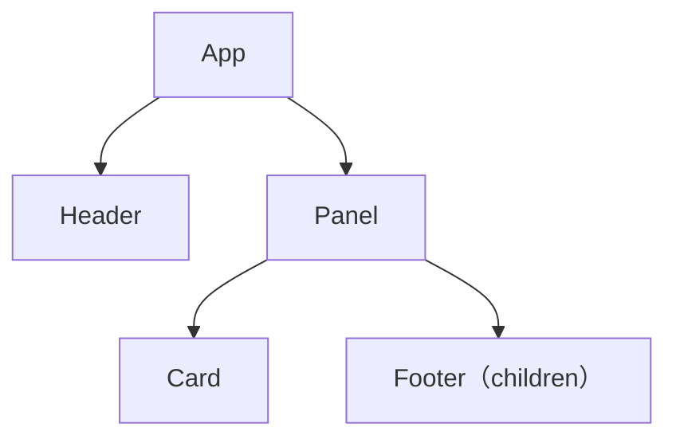
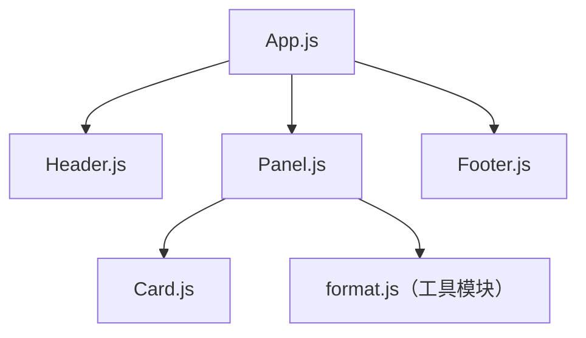

## 你的第一个组件

> [!info] 一句话理解
> **组件**是用 JavaScript 函数描述的一块 UI：定义一次，就能在其他组件中组合、嵌套和重复使用。

### 组件如何工作

- HTML 提供 `<section>`、`<h1>` 等内置标签；React 允许把标签与逻辑组织成自定义组件，如 `<Profile />`。
- React 组件返回 **JSX**（在 JavaScript 中书写类似 HTML 的标签）。渲染后，浏览器看到的是组件生成的实际 DOM 标签，而不是 `<Profile />` 这个自定义名称。

### 定义与使用
1. 导出组件
2. 使用`function Profile() { }`定义函数，组件名必须是大写
3. 返回 JSX
```jsx
function Profile() {
  return ;
}

export default function Gallery() {
  return (
    <section>
      <h1>用户</h1>
      <Profile />
      <Profile />
    </section>
  );
}
```
1. `function Profile() { ... }` 定义组件；**组件名以大写字母开头**，这样 JSX 才能区分 `<Profile />` 与小写的 HTML 标签 `<section>`。
2. `return` 返回 JSX。多行 JSX 要紧跟 `return ()`，没有括号包裹的话，任何在 `return` 下一行的代码都 将被忽略！
3. 在 `Gallery` 中写 `<Profile />` 即可使用组件；此时 `Gallery` 是父组件，`Profile` 是子组件。同一个组件可以使用多次。
4. `export default` 是 JavaScript 的默认导出语法，用于让其他文件导入该组件；它不是 React 专属语法，也不是每个组件都必须写。 

> [!warning] 不要在组件函数内部定义另一个组件
> 组件**可以渲染**其他组件，但组件函数应定义在文件顶层。把 `Profile` 定义在 `Gallery` 内部会在每次渲染时创建新的组件类型，带来性能问题，并可能意外重置状态。若子组件需要父组件的数据，应通过 props 传递，而不是嵌套定义函数。

## 组件的导入与导出

> [!info] 一句话理解
> 当一个文件中的组件越来越多时，可以把组件拆到不同文件：**先导出，再在需要使用它的文件中导入**。导出方式必须与导入方式匹配。
### 默认导出与具名导出

| 方式  | 导出                                     | 导入                                        |
| --- | -------------------------------------- | ----------------------------------------- |
| 默认  | `export default function Gallery() {}` | `import Gallery from './Gallery.js';`     |
| 具名  | `export function Profile() {}`         | `import { Profile } from './Gallery.js';` |

1. **默认导出**不加花括号导入；导入时可以重新命名，但最好使用有意义且一致的名称。每个文件最多只能有一个默认导出。
2. **具名导出**用花括号导入；名称要与导出名一致。一个文件可以有多个具名导出。
3. 一个文件可以同时有一个默认导出和多个具名导出；团队也可以约定只用一种风格，减少混淆。

例如，`Gallery.js` 导出两个组件：

```jsx
// Gallery.js
export function Profile() {
  return ;
}

export default function Gallery() {
  return <section><Profile /></section>;
}
```

`App.js` 从同一文件导入默认组件和具名组件：

```jsx
// App.js
import Gallery, { Profile } from './Gallery.js';

export default function App() {
  return <><Profile /><Gallery /></>;
}
```

> [!warning] 导入方式不要写反
> `import Profile from './Gallery.js'` 取得的是该文件的**默认导出**，不是具名导出的 `Profile`。要导入后者，应写 `import { Profile } from './Gallery.js'`。另外，`./Gallery.js` 比省略扩展名的写法更贴近原生 ES 模块。

## 使用 JSX 书写标签语言

> [!info] 一句话理解
> **JSX** 让组件在 JavaScript 中写类似 HTML 的标签，把“显示什么”和“如何决定显示内容”的逻辑放在一起；但 JSX **不是 HTML**，语法要求更严格。

### 写 JSX 时先检查三件事

1. **只有一个顶层元素**：相邻标签要用父元素包住；不想增加额外 DOM 节点时，用 Fragment：`<>...</>`。
2. **每个标签都要闭合**：``、`<br />` 这样自闭合；`<li>内容</li>` 这样成对闭合，不能依赖 HTML 的省略规则。
3. **属性名按 JSX 写法**：`class` 改为 `className`，`stroke-width` 改为 `strokeWidth`。多数属性使用驼峰命名，但 `aria-*`、`data-*` 保留连字符。

### 把 HTML 改成 JSX

下面的组件一次体现了三个规则：两个并列节点用 Fragment 包住；`img` 自闭合；CSS 类名用 `className`。

```jsx
export default function Profile() {
  return (
    <>
      <h1>个人资料</h1>
      
    </>
  );
}
```

这里的 `<>...</>` 只负责分组，不会在页面中多生成一层元素；`data-role` 则展示了保留连字符的例外。

> [!warning] 不要把现成 HTML 原样粘进组件
> 遇到 JSX 报错时，先检查**顶层元素、标签闭合、属性名**，再看浏览器或编译器的具体提示。JSX 是 JavaScript 的语法扩展，React 是 UI 库，两者不是同一个概念。

## 在 JSX 中通过大括号使用 JavaScript

> [!info] 一句话理解
> JSX 中的 `{}` 是进入 JavaScript **表达式**的入口：固定内容直接写文本，字符串用引号，动态内容用大括号读取变量、对象属性或计算结果。

### 先区分固定值和动态值

| 需求    | JSX 写法                      | 实际含义          |
| ----- | --------------------------- | ------------- |
| 固定字符串 | `alt="用户头像"`                | 传入文字“用户头像”    |
| 变量的值  | `src={avatar}`              | 读取变量 `avatar` |
| 计算结果  | `{formatName(person.name)}` | 调用函数并显示返回值    |

大括号主要放在两个位置：**标签之间的内容**（`<h1>{name}</h1>`）和**属性的等号后**（`src={avatar}`）。不要写成 `src="{avatar}"`，那会得到字面字符串 `{avatar}`；也不能用 `<{tag}>` 动态拼标签名。

### 把数据用于标签、属性和样式

```jsx
const person = {
  name: '小明',
  avatar: '/avatar.png',
  theme: { backgroundColor: 'black', color: 'white' },
};

export default function Profile() {
  return (
    <section style={person.theme}>
      <h1>{person.name}的资料</h1>
      
    </section>
  );
}
```

- `{person.name}` 显示对象中的字符串；`src={person.avatar}` 将对象属性用作标签属性。
- `style` 接收 **JavaScript 对象**，因此可以写 `style={person.theme}`。直接写对象时是 `style={{ color: 'white' }}`：外层 `{}` 嵌入表达式，内层 `{}` 创建对象，并非新的 JSX 语法。
- 样式对象的属性名也使用驼峰式，如 `backgroundColor`，而不是 CSS 文本里的 `background-color`。

> [!warning] 对象不能直接当作标签文本
> `<h1>{person}</h1>` 会报 `Objects are not valid as a React child`；应选出要显示的字段，如 `{person.name}`。对象可以作为 `style` 等需要对象值的属性传入，不代表它能直接渲染成文字。

## 将 Props 传递给组件

> [!info] 一句话理解
> **Props 是父组件传给子组件的输入**，就像函数参数。它们让同一个组件根据不同数据渲染不同内容，而不用复制组件代码。

### 传入与读取

```jsx
function Avatar({ person, size = 80 }) {
  return (
    
  );
}

export default function Profile() {
  const person = { name: '小明', avatar: '/avatar.png' };
  return <Avatar person={person} size={100} />;
}
```

1. 父组件在 `<Avatar person={person} size={100} />` 中传值；自定义组件的 prop 不限于字符串，也可以是数字、对象、数组、函数等 JavaScript 值。
2. 子组件的 `({ person, size })` 是**解构函数参数**，等价于接收 `props` 对象后读取 `props.person` 和 `props.size`；这里的花括号不是在 JSX 中插入表达式。
3. `size = 80` 是默认值：省略 `size` 或传入 `undefined` 时生效；传入 `0` 或 `null` 时**不会**使用默认值。

### 让组件接收一块内容：`children`，这个`children`可以是一个其他组件

```jsx
function Card({ children }) {
  return <div className="card">{children}</div>;
}

function ProfileCard({ person }) {
  return (
    <Card>
      <Avatar person={person} />
    </Card>
  );
}
```

`<Card>...</Card>` 中间的 JSX 会作为 `children` prop 传给 `Card`。适合卡片、面板等**只负责外壳，不需要知道内部具体内容**的组件。

### 何时转发所有 props

包装组件如果只是原样转交输入，可以写 `<Avatar {...props} />`，无需逐项列出。但应克制使用：明确写出重要 props 通常更易读；到处展开可能说明组件职责需要重新拆分。

> [!warning] Props 是只读的
> 组件每次渲染收到的是当下的 props；父组件以后可以传入新值，但子组件不应直接修改它们。需要随交互改变的本地数据应使用 state，而不是改写 props。

## 条件渲染

> [!info] 一句话理解
> React 不需要专门的条件标签：用 JavaScript 判断条件，再决定**返回哪段 JSX**，或决定**某段 JSX 是否出现**。

### 按需求选择写法

| 需求 | 推荐写法 | 例子 |
| --- | --- | --- |
| 整个组件有不同分支 | `if` 后分别 `return` | `if (loading) return <p>加载中</p>;` |
| 两种内容二选一 | 三目运算符 `? :` | `{online ? '在线' : '离线'}` |
| 满足条件才显示 | `&&` | `{hasAlert && <Alert />}` |
| 当前不渲染任何内容 | `return null` | `if (hidden) return null;` |

例如，保留同一个外层结构，只切换其中的文字和提示：

```jsx
function Status({ online, messageCount }) {
  return (
    <section>
      <h2>{online ? '在线' : '离线'}</h2>
      {messageCount > 0 && <p>有 {messageCount} 条新消息</p>}
    </section>
  );
}
```

`? :` 适合明确的两种结果；`&&` 适合“有或没有”。如果分支逻辑很长、三目运算符嵌套太深，就在 `return` 前用 `if` 计算变量，或拆成更小的组件，不必追求一行写完。

### 不渲染与避免重复

```jsx
function Notice({ hidden, message }) {
  if (hidden) return null;
  return <p>{message}</p>;
}
```

`null` 表示这个组件本次什么都不渲染；如果决定是否显示组件本来就是父组件的职责，也可以在父组件中直接控制是否渲染它。若两个分支共享相同的外层标签，尽量只在**变化的部分**写条件，避免把整段标签复制两份。

> [!warning] `&&` 左侧不要直接放数字
> `{messageCount && <p>新消息</p>}` 在数量为 `0` 时会渲染出 **0**，因为 JavaScript 的 `0 && ...` 结果是数字 `0`。写成 `{messageCount > 0 && <p>新消息</p>}`，让左侧明确得到布尔值。

## 渲染列表

> [!info] 一句话理解
> 把重复的界面写成**数据数组 + `map()`**；需要只显示一部分时先用 `filter()`。数组生成的每个同级 JSX 元素还需要稳定的 `key`，让 React 认出“它是哪一项”。

### 从数据生成界面

```jsx
const tasks = [
  { id: 't1', title: '阅读文档', done: true },
  { id: 't2', title: '完成练习', done: false },
];

export default function TaskList() {
  const pendingTasks = tasks.filter(task => !task.done);

  return (
    <ul>
      {pendingTasks.map(task => (
        <li key={task.id}>{task.title}</li>
      ))}
    </ul>
  );
}
```

1. `filter()` **筛选数据**，这里得到未完成任务；它不负责生成标签。
2. `map()` **逐项转换**，把每条任务变成一个 `<li>`；所得 JSX 数组可以放在 `<ul>` 的大括号中渲染。
3. `key={task.id}` 写在 `map()` 直接生成的元素上，而不是外层的 `<ul>` 上。

### `key` 为什么要稳定

- `key` 是 React 用来识别**同级列表项**的标识。插入、删除、排序时，稳定的 ID 能帮助 React 正确匹配旧项与新项；它只需在当前同级列表中唯一，不必全局唯一。
- 优先使用数据中已有、不会随位置改变的 ID；不要在渲染时用 `Math.random()` 生成，也尽量不要用数组索引。索引会随重排变化，可能导致状态错位；随机数每次都变，还可能使输入状态丢失。
- `key` 不会作为普通 prop 传给组件。子组件若也需要 ID，应另外传入：`<TaskRow key={task.id} taskId={task.id} />`。

> [!warning] `map()` 的箭头函数别漏掉 `return`
> `tasks.map(task => <li>...</li>)` 会隐式返回 JSX；改成块函数体 `tasks.map(task => { ... })` 后，必须显式写 `return <li>...</li>`，否则得到的是一组 `undefined`。

## 保持组件纯粹

> [!info] 一句话理解
> 把组件的**渲染过程**当作计算公式：给定相同的 props、state、context，就应得到相同的 JSX；计算时不要改动渲染前已经存在的数据。

### 识别不纯的渲染

```jsx
let nextGuest = 1;

// ❌ 结果取决于之前渲染了多少次，还修改了外部变量
function BadCup() {
  return <p>第 {nextGuest++} 位客人</p>;
}

// ✅ 编号由父组件作为输入传入
function Cup({ guest }) {
  return <p>第 {guest} 位客人</p>;
}
```

`BadCup` 的同一次“输入”可能得到不同结果；若 React 重试或重复渲染，编号就会改变。`Cup` 只读取输入，不依赖其他组件的渲染顺序。props、state、context 都应作为**只读输入**，不要在渲染时直接改写。

### 局部计算可以改动新建变量

```jsx
function GuestList({ guests }) {
  const items = [];
  for (const guest of guests) {
    items.push(<li key={guest.id}>{guest.name}</li>);
  }
  return <ul>{items}</ul>;
}
```

`items` 每次调用 `GuestList` 时才创建，因此在本次渲染里 `push` 是安全的。区别在于：**可改动本次调用内部新建的值，不可改动调用前就存在的对象、props 或外部变量**。

### 把副作用移出渲染

- 渲染时只计算要返回的 JSX，不要直接操作 DOM、发送请求或修改外部数据。
- 用户点击等动作引发的变更，通常放在**事件处理函数**；需要与外部系统同步且无法由事件处理时，再考虑 `useEffect`。
- 开发时的 Strict Mode 可能额外调用组件函数，借此暴露渲染中的副作用；正确的纯组件不应因重复调用而产生不同结果。

> [!warning] 不要用直接操作 DOM 来决定样式
> 与其在组件函数里执行 `document.getElementById(...).className = ...`，不如根据输入算出类名并返回 `<h1 className={isNight ? 'night' : 'day'}>...</h1>`。这样样式仍由 JSX 描述，渲染过程保持纯粹。

## 将 UI 视为树

> [!info] 一句话理解
> 看 React 应用有两种不同的“树”：**渲染树**回答“这次谁渲染了谁”，**模块依赖树**回答“哪个文件导入了哪个文件”。不要把组件的父子关系等同于文件的导入关系。

假设 `App.js` 导入 `Header`、`Panel`、`Footer`；`Panel.js` 导入 `Card` 和工具文件。`App` 把 `<Footer />` 放进 `<Panel>...</Panel>`，而 `Panel` 会渲染 `Card` 与收到的 `children`。

### 渲染树：组件如何组成界面



- **节点是本次实际渲染的组件**，箭头是“父组件渲染子组件”；根是 `App`。这里不画 `<div>`、`<section>` 等 HTML 标签，因此它不是浏览器 DOM 树。
- 条件渲染会改变某一次的树：如果 `Panel` 此次没有渲染 `Card`，本次树里就没有 `Card` 节点。靠近根的组件影响较大的子树，叶子组件则没有子组件。

### 模块依赖树：代码如何连接



- **节点是文件模块**，箭头是 `import` 关系。它可以包含只提供数据或函数、并不渲染 UI 的模块，例如 `format.js`。
- `Footer.js` 由 `App.js` 导入，却因作为 `children` 传给 `Panel`，在渲染树中位于 `Panel` 下面。这正说明：**导入者不一定是渲染时的父组件**。
- 排查组件层级、数据流或渲染性能时看渲染树；分析需要打包哪些代码、包体积为何变大时看依赖树。

> [!tip] 读代码时先问“箭头表示什么”
> `import` 箭头描述静态代码依赖；“渲染”箭头描述某次运行得到的组件关系。同一份代码可以因 props 或 state 不同而产生不同的渲染树，但导入关系不因此改变。
