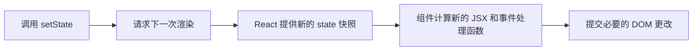

本文整理 React 添加交互的核心知识：事件处理、渲染与提交、State 快照、更新队列，以及对象和数组的不可变更新。

## 响应事件

### 添加事件处理函数

> [!info] 一句话理解
> React 通过把**函数传给事件 prop** 来响应点击、悬停、聚焦、表单提交等交互；事件发生时，React 才调用这个函数。

#### 定义与绑定

```jsx
export default function Button() {
  function handleClick() {
    alert('你点击了我！');
  }

  return <button onClick={handleClick}>点我</button>;
}
```

1. 在组件内部定义事件处理函数，例如 `handleClick`。
2. 把函数传给对应的事件 prop，例如 `onClick={handleClick}`。
3. 用户触发事件后，React 调用这个函数。

事件处理函数通常以 `handle` 开头，后接事件名称；处理逻辑较短时，也可以直接写成内联箭头函数：

```jsx
<button onClick={() => alert('你点击了我！')}>
  点我
</button>
```

> [!warning] 传递函数，不要调用函数
> `onClick={handleClick}` 传递的是函数，点击时才执行；`onClick={handleClick()}` 会在**渲染期间立即调用**函数。
>
> 内联写法同样要传入函数：`onClick={() => alert('...')}`，而不是 `onClick={alert('...')}`。

#### 在事件处理函数中读取 Props

事件处理函数定义在组件内部，因此可以通过闭包直接读取当前组件的 props：

```jsx
function AlertButton({ message, children }) {
  return (
    <button onClick={() => alert(message)}>
      {children}
    </button>
  );
}

export default function Toolbar() {
  return (
    <>
      <AlertButton message="正在播放！">播放电影</AlertButton>
      <AlertButton message="正在上传！">上传图片</AlertButton>
    </>
  );
}
```

这里两个 `AlertButton` 使用的是同一套组件结构，但点击后读取各自收到的 `message`，因此会执行不同的行为。

### 将事件处理函数作为 Props 传递

> [!info] 一句话理解
> 父组件可以把事件处理函数作为 prop 传给子组件，让**父组件决定行为，子组件负责展示和触发**。

```jsx
function Button({ onClick, children }) {
  return <button onClick={onClick}>{children}</button>;
}

function PlayButton({ movieName }) {
  function handlePlayClick() {
    alert(`正在播放 ${movieName}！`);
  }

  return (
    <Button onClick={handlePlayClick}>
      播放「{movieName}」
    </Button>
  );
}

function UploadButton() {
  return (
    <Button onClick={() => alert('正在上传！')}>
      上传图片
    </Button>
  );
}
```

`Button` 不需要知道点击后要播放电影还是上传图片，它只负责把收到的 `onClick` 绑定到浏览器的 `<button>`；具体行为由使用它的组件传入。这样可以复用组件外观，同时保持业务逻辑灵活。

#### 自定义事件 Prop 的命名

浏览器内置元素只能使用浏览器支持的事件名，例如 `onClick`；自定义组件接收的 prop 可以按业务含义命名，但通常以 `on` 开头并紧跟大写字母。

```jsx
function Toolbar({ onPlayMovie, onUploadImage }) {
  return (
    <div>
      <Button onClick={onPlayMovie}>播放电影</Button>
      <Button onClick={onUploadImage}>上传图片</Button>
    </div>
  );
}
```

`onPlayMovie` 比 `onClick` 更能表达“要做什么”。将来即使改为通过键盘快捷键触发播放，外部组件仍然不需要改变业务接口。

> [!warning] 使用语义化 HTML
> 处理点击时优先使用 `<button>`，不要为了方便给 `<div>` 添加 `onClick`。原生按钮自带键盘操作和无障碍能力；若不喜欢默认外观，应使用 CSS 修改样式。

### 事件传播

> [!info] 一句话理解
> 子元素触发的事件通常会沿着组件树向上**冒泡**：先执行被点击元素的处理函数，再执行外层元素的处理函数。

```jsx
export default function Toolbar() {
  return (
    <div onClick={() => alert('点击了工具栏')}>
      <button onClick={() => alert('点击了播放按钮')}>
        播放电影
      </button>
    </div>
  );
}
```

点击按钮时，按钮自己的 `onClick` 先执行，外层 `<div>` 的 `onClick` 随后执行；直接点击工具栏空白区域时，只执行外层处理函数。

React 中除 `onScroll` 外，事件通常都会传播；`onScroll` 只作用于绑定它的 JSX 元素。

#### 阻止事件传播

事件处理函数会接收事件对象，通常命名为 `e`。调用 `e.stopPropagation()` 可以阻止事件继续冒泡：

```jsx
function Button({ onClick, children }) {
  return (
    <button
      onClick={e => {
        e.stopPropagation();
        onClick();
      }}
    >
      {children}
    </button>
  );
}
```

此时点击按钮只会执行按钮内部的处理逻辑，不会再触发外层元素的 `onClick`。

#### 捕获阶段

在事件名称末尾添加 `Capture`，可以在事件到达目标元素之前处理它：

```jsx
<div onClickCapture={() => logClick()}>
  <button onClick={e => e.stopPropagation()}>按钮</button>
</div>
```

事件按以下顺序传播：

1. 从外向内执行 `onClickCapture`。
2. 执行目标元素的 `onClick`。
3. 从内向外执行祖先元素的 `onClick`。

捕获阶段常用于路由或数据埋点。即使目标元素调用了 `e.stopPropagation()`，外层的捕获处理函数仍然已经执行。

#### 显式调用处理函数

如果依赖事件冒泡后很难追踪执行顺序，可以由子组件先处理自己的逻辑，再显式调用父组件传入的函数：

```jsx
<button
  onClick={e => {
    e.stopPropagation();
    // 子组件自己的逻辑
    onClick();
  }}
>
  {children}
</button>
```

这种方式不会自动触发父元素的点击处理，而是明确写出调用链，复杂交互中通常更容易理解和调试。

### 阻止浏览器默认行为

> [!info] 一句话理解
> `e.preventDefault()` 阻止浏览器对事件执行默认操作，例如阻止表单提交后刷新页面；它不会阻止事件传播。

```jsx
export default function Signup() {
  return (
    <form
      onSubmit={e => {
        e.preventDefault();
        alert('提交表单！');
      }}
    >
      <input />
      <button>发送</button>
    </form>
  );
}
```

| 方法 | 解决的问题 |
| --- | --- |
| `e.stopPropagation()` | 不让事件继续触发外层元素的处理函数 |
| `e.preventDefault()` | 不让浏览器执行该事件自带的默认行为 |

> [!warning] 两者不能互相替代
> 阻止表单刷新使用 `preventDefault()`；阻止父元素同时响应点击使用 `stopPropagation()`。是否传播与是否执行默认行为是两个独立问题。

### 事件处理函数与副作用

> [!info] 一句话理解
> 渲染过程应保持纯粹，而事件处理函数正是执行副作用的合适位置，例如更新状态、发送请求或操作浏览器 API。

```jsx
function LightSwitch() {
  function handleClick() {
    document.body.classList.toggle('dark');
  }

  return <button onClick={handleClick}>切换背景</button>;
}
```

事件处理函数可以修改内容，但如果数据变化需要驱动组件重新渲染，应把数据保存在 React `state` 中，而不是只修改普通变量。后续学习 state 时，可以把“用户触发事件”和“组件记住变化”连接起来理解。

## 渲染和提交

> [!info] 一句话理解
> React 更新界面要经过**触发渲染 → 渲染组件 → 提交 DOM** 三个步骤，最后浏览器再绘制屏幕；“组件被渲染”不等于“DOM 一定被修改”。


这里的几个词表示不同阶段：

| 阶段  | 实际发生的事情                            |
| --- | ---------------------------------- |
| 触发  | React 收到一次初始显示或状态更新请求              |
| 渲染  | React 调用组件，根据 props 和 state 计算 JSX |
| 提交  | React 把前后两次结果的必要差异应用到 DOM          |
| 绘制  | 浏览器根据最新 DOM 更新屏幕像素                 |

### 第一步：触发渲染

React 只会在有原因时开始一次渲染，常见原因有两个：

1. 应用进行**初次渲染**。
2. 组件或其祖先组件的 **state 发生更新**。

应用启动时，`createRoot` 取得 React 要管理的 DOM 节点，`root.render` 指定根组件：

```jsx
import { createRoot } from 'react-dom/client';
import App from './App.js';

const root = createRoot(document.getElementById('root'));
root.render(<App />);
```

初次渲染后，调用 state 的更新函数会把一次新的渲染请求加入队列。React 随后重新计算界面，而不是要求开发者手动操作 DOM。

> [!warning] `root.render` 和组件重新渲染不是一回事
> `root.render(<App />)` 用于把 React 应用挂载到根节点；应用运行后的界面更新通常由 state 变化触发，不需要反复调用 `root.render`。

### 第二步：React 渲染组件

在 React 中，**渲染就是调用组件函数**，目的是计算当前应该显示什么：

- 初次渲染时，React 从根组件开始调用。
- 后续渲染时，React 调用触发更新的组件。
- 如果组件返回了其他组件，React 会继续递归调用这些子组件，直到得到完整的元素结构。

```jsx
export default function Gallery() {
  return (
    <section>
      <h1>鼓舞人心的雕塑</h1>
      <Image />
      <Image />
      <Image />
    </section>
  );
}

function Image() {
  return ;
}
```

渲染 `Gallery` 时，React 会调用一次 `Gallery()`，再根据它返回的 JSX 调用三次 `Image()`。渲染阶段只负责计算结果，真正的 DOM 修改要等到提交阶段。

> [!warning] 渲染必须是纯计算
> 相同的 props、state 和 context 应产生相同的 JSX；组件在渲染期间不应修改外部变量、已有对象或 DOM。副作用应放在事件处理函数中，或在确实需要与外部系统同步时使用 Effect。

开发环境中的严格模式可能会额外调用组件函数，以帮助暴露渲染期间的副作用。因此，不要假设组件函数只会执行一次。

### 第三步：React 提交 DOM 更改

渲染完成后，React 才进入提交阶段：

- **初次渲染**：创建所需 DOM 节点并加入页面。
- **重新渲染**：比较本次与上次的渲染结果，只执行让 DOM 与最新结果一致所需的更改。

```jsx
export default function Clock({ time }) {
  return (
    <>
      <h1>{time}</h1>
      <input />
    </>
  );
}
```

即使父组件每秒传入新的 `time`，React 也只需要更新 `<h1>` 的文本。由于 `<input>` 仍位于相同位置且属性没有变化，React 不会替换它，用户已经输入的内容也不会因为这次重新渲染而消失。

> [!info] 渲染不一定导致 DOM 更新
> React 可以重新调用组件并得到新的渲染结果，但如果结果与上次相同，就没有必要修改 DOM。组件执行、虚拟界面计算和真实 DOM 更新是三个不同概念。

### 最后：浏览器绘制

React 把必要更改提交到 DOM 后，浏览器才根据最新 DOM 和 CSS 重新绘制页面。为了避免混淆：

- **React 渲染**：调用组件，计算 JSX。
- **React 提交**：修改真实 DOM。
- **浏览器绘制**：把页面显示到屏幕上。

理解这条链路有助于定位问题：组件函数执行了但页面没变化，可能是渲染结果没有改变；DOM 已更新但视觉仍异常，则还要检查 CSS、布局或浏览器绘制相关问题。

## State 如同一张快照

> [!info] 一句话理解
> 每次渲染都会得到一份固定的 state 快照；调用 `setState` 只是请求 React 使用新值进行**下一次渲染**，不会修改当前这次渲染中的变量。

### 设置 State 会触发新的渲染

```jsx
import { useState } from 'react';

export default function Form() {
  const [isSent, setIsSent] = useState(false);
  const [message, setMessage] = useState('你好！');

  if (isSent) {
    return <h1>消息正在发送！</h1>;
  }

  return (
    <form
      onSubmit={e => {
        e.preventDefault();
        setIsSent(true);
        sendMessage(message);
      }}
    >
      <textarea
        value={message}
        onChange={e => setMessage(e.target.value)}
      />
      <button type="submit">发送</button>
    </form>
  );
}
```

提交表单时会依次发生：

1. 执行当前渲染创建的 `onSubmit` 处理函数。
2. `setIsSent(true)` 请求 React 进行下一次渲染。
3. React 再次调用 `Form`，这次拿到的 `isSent` 为 `true`。
4. 组件返回新的 JSX，界面显示“消息正在发送”。

`setIsSent(true)` 并不是修改当前函数里的 `isSent`，而是告诉 React：下一次调用组件时，请提供更新后的 state。

### 每次渲染都有自己的快照

React 将 state 保存在组件函数之外。每次调用组件时，React 会把**本次渲染对应的 state 值**交给组件，组件再用它计算：

- 返回的 JSX；
- props 和局部变量；
- 事件处理函数；
- 处理函数能够读取到的 state。



因此，每次渲染都像生成了一张完整的可交互照片。旧快照中的事件处理函数继续看到旧 state，新快照中的事件处理函数则看到新 state。

> [!warning] State 不是普通的可变变量
> 普通变量可以在函数执行过程中被重新赋值；state 值在一次渲染中是固定的。调用 setter 不会改写当前快照，只会安排下一次渲染。

### 为什么连续设置三次只增加一次

```jsx
import { useState } from 'react';

export default function Counter() {
  const [number, setNumber] = useState(0);

  return (
    <>
      <h1>{number}</h1>
      <button
        onClick={() => {
          setNumber(number + 1);
          setNumber(number + 1);
          setNumber(number + 1);
        }}
      >
        +3
      </button>
    </>
  );
}
```

第一次渲染时，`number` 的快照是 `0`。因此这三行代码实际都等价于：

```jsx
setNumber(0 + 1);
setNumber(0 + 1);
setNumber(0 + 1);
```

三次请求都要求下一次 state 变成 `1`，所以重新渲染后显示的是 `1`，不是 `3`。在事件处理函数执行期间，`number` 不会因为调用了 `setNumber` 而变成 `1`。

> [!tip] 用“值替换法”推导结果
> 分析某次渲染中的代码时，可以把所有 state 变量替换为这次渲染的具体值。例如把 `number` 全部替换为 `0`，就能直接看出连续三次调用提交的都是相同结果。

如果需要根据前一次待处理的值连续更新，应使用状态更新函数，例如 `setNumber(n => n + 1)`；它与直接传值的执行方式不同。

### Setter 调用后仍会读到旧值

```jsx
<button
  onClick={() => {
    setNumber(number + 5);
    alert(number);
  }}
>
  +5
</button>
```

假设当前界面中的 `number` 是 `0`，点击后弹窗仍显示 `0`。可以把代码理解为：

```jsx
setNumber(0 + 5); // 请求下一次渲染使用 5
alert(0);         // 当前快照仍然是 0
```

界面会在事件处理完成并重新渲染后显示 `5`，但已经开始执行的处理函数不会突然切换到下一次渲染的 state。

### 异步回调也会记住创建时的快照

```jsx
<button
  onClick={() => {
    setNumber(number + 5);
    setTimeout(() => {
      alert(number);
    }, 3000);
  }}
>
  +5
</button>
```

即使定时器在组件重新渲染之后才执行，它仍然读取创建该回调时的 `number`。如果点击时 `number` 为 `0`，三秒后弹窗显示的仍是 `0`，而不是重新渲染后的 `5`。

原因不是 React 把 state “还原”了，而是这个回调属于旧渲染，它通过闭包保留了旧快照中的值。

```jsx
function handleSubmit(e) {
  e.preventDefault();

  setTimeout(() => {
    alert(`你向 ${to} 发送了：${message}`);
  }, 5000);
}
```

如果提交时收件人是 Alice、消息是“你好”，随后立刻把表单改成 Bob，已经安排的回调仍会显示发送给 Alice。它记录的是用户点击提交时那次渲染中的 `to` 和 `message`。

> [!info] 快照让事件行为保持一致
> 一个事件处理函数从开始到结束都看到同一组 state，不会因为其他更新在执行中途发生而突然改变含义。这让异步代码对应的用户操作更容易推理。

### 常见理解对比

| 错误理解                        | 正确理解                       |
| --------------------------- | -------------------------- |
| `setNumber(1)` 会立即改写变量      | 它请求下一次渲染使用 `1`             |
| 同一处理函数中的 state 会随 setter 改变 | 一次渲染中的 state 始终固定          |
| 定时器执行时会自动读取最新 state         | 回调默认读取创建它的那次渲染快照           |
| 组件自己保存 state                | state 由 React 保存，组件渲染时取得快照 |
| 重新渲染只是重新生成 HTML             | 它还会生成基于新 state 的变量和事件处理函数  |

理解 state 快照后，判断代码行为时要先问：**这个函数属于哪一次渲染？那次渲染中的 state 是什么？**

## 把 State 更新加入队列

> [!info] 一句话理解
> React 会先收集一个事件中的 state 更新，等事件处理函数执行完再统一渲染；当下一个值依赖前一个值时，应传入**更新函数**，让 React 按队列顺序计算。

### React 会批量处理 State 更新

```jsx
<button
  onClick={() => {
    setNumber(number + 1);
    setNumber(number + 1);
    setNumber(number + 1);
  }}
>
  +3
</button>
```

假设当前渲染中的 `number` 是 `0`，三次调用读取的都是同一张 state 快照，因此它们实际上都是：

```jsx
setNumber(1);
setNumber(1);
setNumber(1);
```

React 不会在每个 setter 调用后立刻重新渲染，而是等事件处理函数中的代码执行完，再统一处理收集到的更新。这个过程称为**批处理**。

批处理有两个主要作用：

- 多个 state 更新只触发必要的重新渲染，减少无效工作。
- 避免界面显示只更新了一部分 state 的“半成品”状态。

```jsx
function handleClick() {
  setLoading(true);
  setError(null);
  setResult(newResult);
  // 处理函数结束后，React 再统一处理这些更新
}
```

> [!warning] 批处理不会改变 State 快照
> 批处理解释了 React **何时处理**更新；state 快照解释了处理函数**能读到什么值**。即使连续调用多个 setter，当前处理函数中的 state 仍然不会改变。

React 不会把两次独立的用户操作合并成一个事件。例如，两次点击会分别处理，以确保第一次点击产生的结果能影响第二次点击。

### 使用更新函数连续修改同一个 State

如果下一次 state 需要根据队列中的前一个值计算，应向 setter 传入函数，而不是直接传值：

```jsx
<button
  onClick={() => {
    setNumber(n => n + 1);
    setNumber(n => n + 1);
    setNumber(n => n + 1);
  }}
>
  +3
</button>
```

`n => n + 1` 称为**状态更新函数**。React 会把三个函数依次加入队列，并把前一个函数的返回值传给下一个函数：

| 更新队列         | 接收到的 `n` | 返回值 |
| ------------ | -------: | --: |
| `n => n + 1` |        0 |   1 |
| `n => n + 1` |        1 |   2 |
| `n => n + 1` |        2 |   3 |

最终结果为 `3`，所以点击一次按钮能够真正增加三次。

```jsx
// 直接传值：用当前快照计算一个确定的新值
setNumber(number + 1);

// 传入更新函数：根据队列中的前一个值计算新值
setNumber(previousNumber => previousNumber + 1);
```

> [!tip] 什么时候使用更新函数
> 如果新 state 依赖旧 state，尤其是同一事件中有多次更新、异步逻辑或快速连续操作时，优先写成 `setState(prev => next)`。如果只是替换为一个与旧值无关的固定值，直接传值更清楚。

### 直接传值与更新函数可以混合

setter 接收的内容可以理解为两种队列指令：

- `setNumber(5)`：把结果**替换为 `5`**。
- `setNumber(n => n + 1)`：用队列中的前一个结果执行计算。

假设当前 `number` 是 `0`：

```jsx
setNumber(number + 5);
setNumber(n => n + 1);
```

队列的计算过程是：

| 更新队列 | 输入 | 结果 |
| --- | ---: | ---: |
| 替换为 `5` | 0（不使用） | 5 |
| `n => n + 1` | 5 | 6 |

所以下一次渲染得到 `6`。

如果最后再加入一次直接替换：

```jsx
setNumber(number + 5);
setNumber(n => n + 1);
setNumber(42);
```

处理过程为 `0 → 5 → 6 → 42`，最终结果是 `42`。后面的“替换为 `42`”不需要使用前面计算出的值。

> [!info] 用队列模型判断最终结果
> 按代码顺序逐条处理：直接传值表示“替换”，更新函数表示“基于当前队列结果计算”。不要只数 setter 调用了几次。

### 更新函数必须保持纯粹

更新函数会在渲染过程中执行，因此它应该只根据参数计算并返回下一个 state：

```jsx
// 正确：只计算并返回结果
setCount(count => count + 1);

// 错误：更新函数中包含副作用
setCount(count => {
  sendAnalytics(count);
  return count + 1;
});
```

不要在更新函数中发送请求、修改外部变量或再次设置 state。开发环境的严格模式可能会额外调用更新函数，以帮助发现不纯的逻辑，因此更新函数必须允许被重复调用而不产生额外影响。

更新函数参数常见的命名方式包括：

```jsx
setEnabled(enabled => !enabled);
setCount(c => c + 1);
setCount(prevCount => prevCount + 1);
```

短变量适合简单计算；逻辑较长时，使用完整名称或 `prev` 前缀更容易理解。

### 异步操作中的实际应用

下面的写法使用了事件开始时的旧快照。快速点击或等待异步操作完成后，计数可能出错：

```jsx
async function handleClick() {
  setPending(pending + 1);
  await delay(3000);
  setPending(pending - 1);
  setCompleted(completed + 1);
}
```

应根据每次更新真正开始处理时的前一个值计算：

```jsx
async function handleClick() {
  setPending(pending => pending + 1);

  await delay(3000);

  setPending(pending => pending - 1);
  setCompleted(completed => completed + 1);
}
```

这样每次请求都会在当前队列结果上增加或减少，而不是重复使用某次点击时捕获的旧 `pending` 和 `completed`。

### 选择哪种 Setter 写法

| 需求                | 推荐写法                   |
| ----------------- | ---------------------- |
| 替换为与旧值无关的结果       | `setStatus('success')` |
| 根据旧值加一、取反或追加      | `setCount(c => c + 1)` |
| 同一事件中连续更新同一 state | 使用多个更新函数               |
| 异步完成后基于当时的最新值更新   | 使用更新函数                 |
| 明确覆盖队列前面的计算结果     | 最后直接传入新值               |

判断标准不是“代码是否异步”，而是：**新值是否依赖更新队列中的前一个值**。

## 更新 State 中的对象

> [!info] 一句话理解
> 对象可以存入 state，但应把它视为**只读快照**：不要修改旧对象，而要创建包含更改的新对象，并通过 setter 替换 state。

### Mutation 是什么

数字、字符串和布尔值等原始值本身不可变。下面的操作是用新数字替换旧 state，而不是修改数字 `0`：

```jsx
const [x, setX] = useState(0);
setX(5);
```

对象的属性可以被修改，这种直接改变已有对象的操作称为 **mutation**：

```jsx
const [position, setPosition] = useState({ x: 0, y: 0 });

position.x = 5; // 直接修改了 state 中的旧对象
```

虽然 JavaScript 允许这样写，但 React 不知道对象内部发生了变化，因为没有调用 setter。更重要的是，这会改写之前渲染所持有的 state 快照。

> [!warning] 将 State 中的对象视为只读
> 不要修改从当前渲染中取得的 state 对象。创建一个新对象，并把它交给 setter，React 才能可靠地安排重新渲染并保留旧快照。

```jsx
// 错误：修改旧对象，也没有通知 React
position.x = e.clientX;
position.y = e.clientY;

// 正确：创建并设置新对象
setPosition({
  x: e.clientX,
  y: e.clientY,
});
```

#### 局部 Mutation 是安全的

问题不在于给对象属性赋值本身，而在于**是否修改了已被其他代码引用的旧对象**。修改刚刚创建、尚未被共享的新对象是安全的：

```jsx
const nextPosition = {};
nextPosition.x = e.clientX;
nextPosition.y = e.clientY;
setPosition(nextPosition);
```

它与下面的对象字面量写法效果相同：

```jsx
setPosition({
  x: e.clientX,
  y: e.clientY,
});
```

这种只发生在新对象内部的修改称为局部 mutation，不会破坏之前的 state 快照。

### 使用展开语法复制对象

> [!info] 一句话理解
> 只更新对象的部分字段时，先用 `{...oldObject}` 复制其他字段，再在后面写入需要覆盖的新值。

假设表单数据保存在同一个对象中：

```jsx
const [person, setPerson] = useState({
  firstName: 'Barbara',
  lastName: 'Hepworth',
  email: 'bhepworth@sculpture.com',
});
```

直接修改字段不会可靠地更新界面：

```jsx
person.firstName = e.target.value; // 不要这样做
```

应创建一个新对象，并保留其他字段：

```jsx
setPerson({
  ...person,
  firstName: e.target.value,
});
```

对象属性按从左到右的顺序写入，因此 `firstName` 放在展开语法之后，会覆盖旧对象中同名的字段。

> [!warning] 展开顺序会影响结果
> `{ firstName: newName, ...person }` 会被后面的旧 `person.firstName` 覆盖。通常先写 `...person`，再写需要更新的字段。

如果更新依赖队列中最新的对象，也可以结合状态更新函数：

```jsx
setPerson(person => ({
  ...person,
  firstName: e.target.value,
}));
```

#### 用一个处理函数更新多个字段

为输入元素设置与对象属性相同的 `name`，再使用计算属性名，可以复用同一个处理函数：

```jsx
function handleChange(e) {
  const { name, value } = e.target;

  setPerson(person => ({
    ...person,
    [name]: value,
  }));
}
```

```jsx
<input
  name="firstName"
  value={person.firstName}
  onChange={handleChange}
/>

<input
  name="email"
  value={person.email}
  onChange={handleChange}
/>
```

`[name]` 是 JavaScript 的计算属性名。如果事件来自 `name="email"` 的输入框，它就会更新新对象中的 `email` 字段。

### 更新嵌套对象

> [!info] 一句话理解
> 对象展开只复制一层；更新嵌套字段时，需要从发生变化的对象开始，向外逐层创建新对象。

```jsx
const [person, setPerson] = useState({
  name: 'Niki de Saint Phalle',
  artwork: {
    title: 'Blue Nana',
    city: 'Hamburg',
  },
});
```

下面的写法仍然修改了旧的 `artwork` 对象：

```jsx
person.artwork.city = 'New Delhi'; // 错误
```

正确做法是同时创建新的 `artwork` 和新的 `person`：

```jsx
setPerson({
  ...person,
  artwork: {
    ...person.artwork,
    city: 'New Delhi',
  },
});
```

可以按从内到外的顺序理解：

```jsx
const nextArtwork = {
  ...person.artwork,
  city: 'New Delhi',
};

const nextPerson = {
  ...person,
  artwork: nextArtwork,
};

setPerson(nextPerson);
```

没有变化的字段可以继续复用原来的值，但从被修改的对象开始，到 state 顶层路径上的每一层都必须换成新对象。

> [!warning] 对象展开是浅拷贝
> `{...person}` 只创建新的顶层对象，内部的 `artwork` 仍指向原对象。只复制顶层再修改 `nextPerson.artwork.city`，依然会改到旧 state。

#### “嵌套对象”本质上是引用关系

看起来位于另一个对象内部的对象，实际上是独立对象，只是被属性引用：

```jsx
const artwork = {
  title: 'Blue Nana',
  city: 'Hamburg',
};

const personA = { name: 'Niki', artwork };
const personB = { name: 'Copycat', artwork };
```

`personA.artwork`、`personB.artwork` 和 `artwork` 都指向同一个对象。执行：

```jsx
personB.artwork.city = 'Lagos';
```

会让 `personA.artwork.city` 也变成 `Lagos`。因此更新 state 时不能只看代码的“嵌套外观”，还要考虑多个属性是否共享同一个对象引用。

### 使用 Immer 简化嵌套更新

> [!info] 一句话理解
> Immer 允许用类似直接修改的语法编辑 `draft`，再根据记录到的修改自动生成保持不可变性的新对象。

嵌套层级很深时，逐层展开会产生大量重复代码。可以安装并使用 `use-immer`：

```bash
npm install use-immer
```

```jsx
import { useImmer } from 'use-immer';

const [person, updatePerson] = useImmer({
  name: 'Niki',
  artwork: {
    title: 'Blue Nana',
    city: 'Hamburg',
  },
});

function handleCityChange(e) {
  updatePerson(draft => {
    draft.artwork.city = e.target.value;
  });
}
```

这里的 `draft` 是由 Proxy 包装的特殊对象。Immer 会记录对 `draft` 的操作，并生成一个新的不可变结果；它不会直接覆盖旧 state。

> [!warning] Immer 的 Draft 不等于直接修改 State
> 只有 Immer 提供的 `draft` 可以使用这种写法。不要因为使用过 Immer，就对普通 `useState` 返回的对象直接赋值。

如果 state 经常需要更新很深的路径，除了使用 Immer，也应考虑把数据结构设计得更扁平，减少嵌套层级和对象间的共享引用。

### 为什么 State 要保持不可变

> [!info] 一句话理解
> 不直接修改 state 不只是代码风格，它让快照、调试、渲染优化和历史状态等能力都建立在可靠的对象身份上。

## 更新 State 中的数组

> [!info] 一句话理解
> 数组也是对象，应把 state 中的数组视为只读：用**新数组替换旧数组**；如果修改的是数组里的对象，还要为被修改的对象创建新版本。

### 根据操作选择数组方法

| 需求 | 不要直接对旧 state 使用 | 推荐写法 |
| --- | --- | --- |
| 添加元素 | `push()`、`unshift()` | 展开语法、`concat()` |
| 删除元素 | `pop()`、`shift()`、`splice()` | `filter()`、`slice()` |
| 替换或转换元素 | `items[i] = value` | `map()` |
| 在指定位置插入 | `splice()` | `slice()` 配合展开语法 |
| 排序或反转 | `sort()`、`reverse()` | 先复制数组，再操作副本 |

> [!warning] 区分 `slice` 和 `splice`
> `slice(start, end)` 返回一段新数组，包含 `start`、不包含 `end`，不改变原数组；`splice()` 则会直接修改原数组。名字只差一个字母，行为却不同。

### 添加与删除元素

假设组件中有一个任务列表：

```jsx
const [tasks, setTasks] = useState([
  { id: 1, title: '学习 State', done: false },
  { id: 2, title: '完成练习', done: false },
]);
```

添加元素时，将旧数组展开到新数组中。新元素放在展开语法前面就是头部插入，放在后面就是尾部追加：

```jsx
// 两种添加方式，按需要选择一种
setTasks(tasks => [...tasks, newTask]); // 添加到末尾
setTasks(tasks => [newTask, ...tasks]); // 添加到开头
```

这里的 `newTask` 表示已经创建好、具有唯一 `id` 的新任务。使用更新函数，可以基于队列中前一个数组计算新数组。

删除元素时，用 `filter()` 保留不需要删除的项：

```jsx
function handleDelete(taskId) {
  setTasks(tasks => tasks.filter(task => task.id !== taskId));
}
```

`filter` 回调返回 `true` 表示**保留**，不是删除。这里保留所有 ID 不等于目标 ID 的任务，原数组不发生改变。

### 用 `map` 替换或转换元素

`map()` 会为每个元素计算一个返回值，组成长度相同的新数组。修改指定项时返回新值，其他项直接返回原值：

```jsx
function handleToggle(taskId) {
  setTasks(tasks => tasks.map(task =>
    task.id === taskId
      ? { ...task, done: !task.done }
      : task
  ));
}
```

这里有两层更新：

1. `map()` 创建**新数组**。
2. `{ ...task, done: !task.done }` 为目标任务创建**新对象**，其他任务继续复用旧对象。

如果要改变全部元素，就让每次回调都返回更新后的值。例如将所有任务标记为完成：

```jsx
setTasks(tasks => tasks.map(task => ({ ...task, done: true })));
```

也可以根据索引更新原始值数组。例如只增加指定位置的计数：

```jsx
setCounters(counters => counters.map((count, index) =>
  index === targetIndex ? count + 1 : count
));
```

> [!warning] `map` 返回新数组，不代表内部操作一定安全
> 在回调里写 `task.done = true` 仍然修改了旧对象。必须返回新的任务对象，而不只是给旧对象赋值后返回它。

### 在指定位置插入元素

将数组分成“插入点之前”和“从插入点开始”两部分，再把新元素放在中间：

```jsx
const insertAt = 1;

setTasks(tasks => [
  ...tasks.slice(0, insertAt),
  newTask,
  ...tasks.slice(insertAt),
]);
```

例如原数组为 `[A, B, C]`，在索引 `1` 插入 `X`，结果为 `[A, X, B, C]`。原来的 `B` 不会被替换，而是后移一位。

### 排序与反转：先复制，再修改副本

`sort()` 和 `reverse()` 会修改调用它们的数组，但如果操作的是刚创建的副本，就不会破坏旧 state：

```jsx
function handleReverse() {
  setTasks(tasks => {
    const nextTasks = [...tasks];
    nextTasks.reverse();
    return nextTasks;
  });
}

function handleSortById() {
  setTasks(tasks => [...tasks].sort((a, b) => a.id - b.id));
}
```

这属于局部 mutation：修改的是新的数组容器，不是旧数组。这里只改变元素顺序，不修改元素对象的属性。

### 数组的浅拷贝不会复制内部对象

```jsx
const nextTasks = [...tasks];

nextTasks === tasks;       // false：数组容器不同
nextTasks[0] === tasks[0]; // true：仍然指向同一个任务对象

nextTasks[0].done = true;  // 错误：也改到了旧 state 中的任务
```

复制数组只是复制了元素引用。如果两个列表共享相同的任务对象，直接修改对象还可能导致“勾选一个列表，另一个列表也跟着变”的问题。

修复时可以使用前面的 `map + 对象展开`，也可以在新数组中替换目标对象：

```jsx
const nextTasks = [...tasks];
nextTasks[0] = { ...nextTasks[0], done: true };
setTasks(nextTasks);
```

> [!tip] 只复制发生变化的路径
> 修改任务属性时，需要“新数组 + 新任务对象”；若属性中还嵌套对象，则继续复制到被修改的位置。没有变化的元素可以保留引用，不必把整个列表深拷贝一遍。

### 使用 Immer 简化数组更新

沿用前面学过的 `useImmer`，可以直接修改草稿中的元素，由 Immer 生成下一版 state：

```jsx
import { useImmer } from 'use-immer';

export default function TaskList() {
  const [tasks, updateTasks] = useImmer([
    { id: 1, title: '学习数组更新', done: false },
  ]);

  function handleToggle(taskId) {
    updateTasks(draft => {
      const task = draft.find(task => task.id === taskId);
      if (task) {
        task.done = !task.done;
      }
    });
  }

  return (
    <ul>
      {tasks.map(task => (
        <li key={task.id}>
          <label>
            <input
              type="checkbox"
              checked={task.done}
              onChange={() => handleToggle(task.id)}
            />
            {task.title}
          </label>
        </li>
      ))}
    </ul>
  );
}
```

在 Immer 的 `draft` 数组上，也可以使用 `push()`、`pop()` 等方法；这是在修改草稿，不是在直接修改旧 state。普通 `useState` 返回的数组仍需遵守不可变更新规则。
