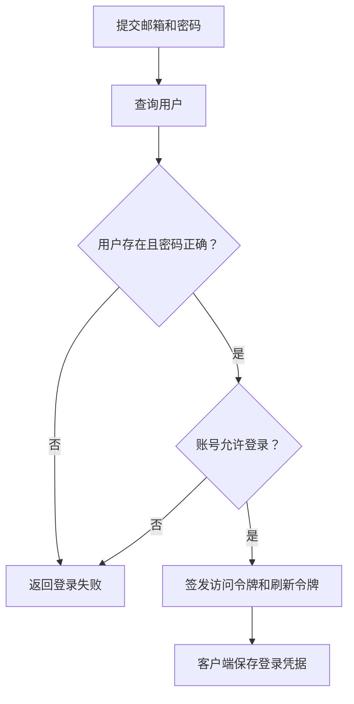
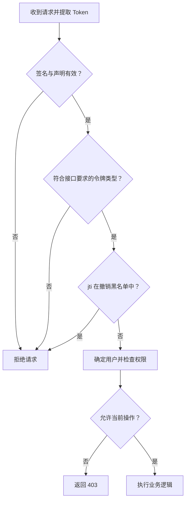
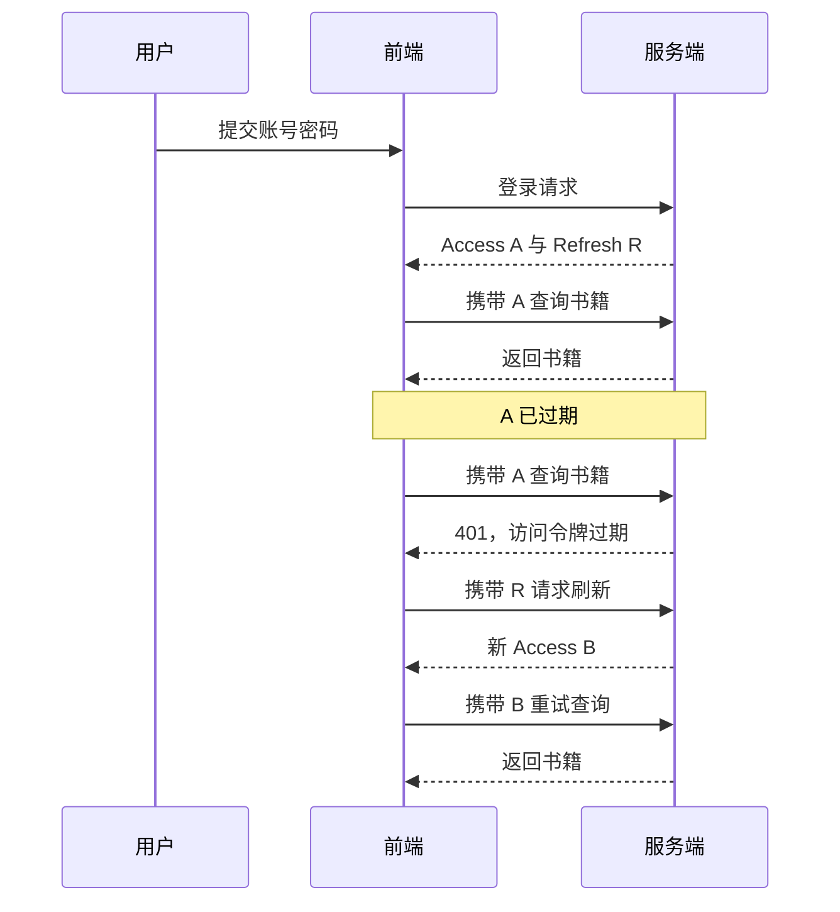
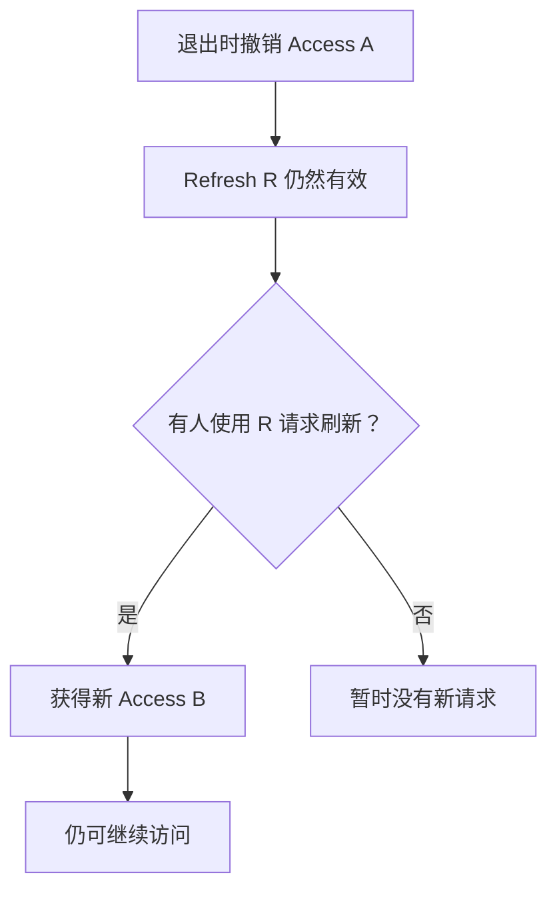

# 用 FastAPI 实现 JWT 登录：从账号密码到刷新与退出

一个书籍管理系统需要支持用户登录：用户输入账号密码后，可以查询和管理自己的书籍；使用过程中尽量不反复登录；点击退出后，服务端应阻止相关令牌继续使用。

本文围绕这个需求，按实现顺序介绍 JWT 登录。先验证账号密码并签发令牌，再保护业务接口，最后实现刷新和退出。JWT 的结构、签名、`exp` 和 `jti` 会在用到它们时解释。

本文参考 FastAPI Beyond CRUD 第九章。代码按功能分段展示，数据库查询、密码哈希校验和应用生命周期需要接入现有项目；它不是一份复制即可运行的完整应用。

## 1. 先确定登录接口要完成什么

登录接口接收邮箱和密码。服务端查找用户，用密码哈希验证函数校验密码，确认账号允许登录后，再签发令牌。



数据库应保存密码哈希，而不是明文密码。登录时使用对应的密码验证函数，不能简单把密码直接比较，也不能拿 JWT 签名函数代替密码哈希。

登录成功之后，后续请求携带 Token，不再重复提交密码。JWT 是承载身份声明的令牌格式；完整登录功能还包含密码校验、令牌验证、刷新、权限判断和撤销。

本文先约定四个接口：

| 接口 | 接收什么 | 做什么 |
| --- | --- | --- |
| `POST /auth/login` | 邮箱、密码 | 返回两个 Token |
| `GET /books` | Access Token | 验证身份后查询书籍 |
| `POST /auth/refresh` | Refresh Token | 返回新的 Access Token |
| `POST /auth/logout` | 需要撤销的登录凭据 | 撤销相关令牌或会话 |

## 2. 登录成功后，为什么返回两个 Token？

| 令牌 | 用途 | 示例有效期 |
| --- | --- | --- |
| Access Token | 访问书籍等业务接口 | 15 分钟 |
| Refresh Token | 获取新的 Access Token | 7 天 |

15 分钟和 7 天只是本文示例，不是 JWT 标准规定。短访问有效期限制访问令牌泄露后的直接可用时间；长刷新有效期减少用户重新输入密码的次数。

两个 Token 可以代表同一个用户，但应有各自的 `jti` 和过期时间。JWT 本身不要求它们直接引用对方，也不规定 Refresh Token 必须是 JWT；刷新令牌还可以是服务端记录的随机字符串。

## 3. 准备要写进 JWT 的登录信息

常见签名 JWT 由三部分组成，中间使用点号连接：

```text
Header.Payload.Signature
```

### Header：说明令牌类型和算法

```json
{
  "alg": "HS256",
  "typ": "JWT"
}
```

这里的 `alg` 表示使用 HS256。服务端必须配置自己允许的算法，不能因为客户端提供的 Header 写了某种算法，就无条件接受它。

### Payload：存储声明

Payload 的正确拼写是 **Payload**，里面的字段叫 Claim（声明）。例如：

```json
{
  "sub": "user-123",
  "iat": 1800000000,
  "exp": 1800000900,
  "jti": "token-a-uuid",
  "refresh": false
}
```

| 字段 | 含义 | 在认证中的作用 |
| --- | --- | --- |
| `sub` | 主体标识 | 本文用它保存用户 ID |
| `iat` | 签发时间 | 表示什么时候生成 |
| `exp` | 过期时间 | 当前时间到达它时，令牌过期 |
| `jti` | JWT 唯一标识 | 区分具体令牌，可用于撤销 |
| `iss` | 签发者 | 验证令牌是否来自预期签发方 |
| `aud` | 使用方 | 验证令牌是否供当前服务使用 |
| `nbf` | 生效时间 | 在此时间之前不能接受 |
| `refresh` | 自定义字段 | 本文用布尔值区分访问令牌与刷新令牌 |

这些注册声明不是全部天然必填；应用应明确自己要求哪些字段。时间字段使用 Unix 时间戳，单位是秒。`refresh` 不是 JWT 标准字段。[^1]

用户 ID 可以放在 `sub` 中，也可以由项目自定义字段存储。服务端读取时，应与签发时的结构保持一致。

**普通签名 JWT 的 Payload 可以被解码查看。Base64URL 编码不是加密。** 不要把密码、密钥放进去。角色、邮箱等字段也要考虑必要性与隐私；角色发生变化，旧 Token 中的信息不会自动更新。

### Signature：保护完整性

以 HS256 为例，其计算关系可以写成：

```text
签名 = Base64URL(
    HMAC-SHA256(密钥, 编码后的Header + "." + 编码后的Payload)
)
```

修改 Payload 后，原签名就不能验证通过。能读取内容，不代表能伪造有效内容。

## 4. 配置密钥，并实现令牌签发

```python
JWT_SECRET: str
JWT_ALGORITHM: str
```

| 名称 | 是什么 | HS256 中的用途 |
| --- | --- | --- |
| `JWT_SECRET` | 保密的密钥 | 生成签名和验证签名 |
| `JWT_ALGORITHM` | 算法名称 | 例如 `HS256` |
| Signature | 计算结果 | JWT 的第三部分 |

**密钥不是签名，算法也不是密钥。** 算法是计算方法，密钥是保密参数，签名是计算结果。

对于 HS256，签发方和验证方使用同一密钥。对于 RS256，签发方使用私钥，验证方使用公钥。密钥应通过配置或秘密管理机制提供，不能直接照搬公开教程里的示例值。

验签不是“和服务端保存的某个固定签名比较”。每个 JWT 的内容可能不同，所以签名也不同；服务端验证的是这一个 Token 的签名与其内容是否匹配。[^2]

### 实现签发与验证函数

本文示例使用 UTC 时间，Access Token 有效期为 15 分钟，Refresh Token 为 7 天。

```python
import os
from datetime import datetime, timedelta, timezone
from uuid import uuid4

import jwt

JWT_SECRET = os.environ["JWT_SECRET"]
JWT_ALGORITHM = "HS256"
JWT_ISSUER = "book-api"
JWT_AUDIENCE = "book-client"

def create_token(user_id: str, *, refresh: bool = False) -> str:
    now = datetime.now(timezone.utc)
    lifetime = timedelta(days=7) if refresh else timedelta(minutes=15)
    payload = {
        "sub": str(user_id),
        "iat": now,
        "exp": now + lifetime,
        "jti": str(uuid4()),
        "iss": JWT_ISSUER,
        "aud": JWT_AUDIENCE,
        "refresh": refresh,
    }
    return jwt.encode(payload, JWT_SECRET, algorithm=JWT_ALGORITHM)

def decode_token(token: str) -> dict:
    return jwt.decode(
        token,
        key=JWT_SECRET,
        algorithms=[JWT_ALGORITHM],
        issuer=JWT_ISSUER,
        audience=JWT_AUDIENCE,
        options={
            "require": ["sub", "iat", "exp", "jti", "iss", "aud", "refresh"]
        },
    )
```

`jwt.decode()` 在这里会验签、验证相关声明，不是仅仅做 Base64 解码。明确 `require` 可以拒绝缺少必需字段的令牌；字段存在之后，应用还要验证自定义字段类型和语义。[^3]

## 5. 编写登录接口

有了 `create_token()`，登录接口就能在密码验证成功后签发两个 Token：

```python
from fastapi import APIRouter, Depends, HTTPException
from pydantic import BaseModel
from sqlmodel.ext.asyncio.session import AsyncSession

# 接入项目已有的 get_session、user_service 和 verify_password。
# get_user_by_email() 返回用户或 None。
# verify_password(明文密码, 密码哈希) 返回 bool。
router = APIRouter(prefix="/auth")

class LoginRequest(BaseModel):
    email: str
    password: str

@router.post("/login")
async def login(
    data: LoginRequest,
    session: AsyncSession = Depends(get_session),
):
    user = await user_service.get_user_by_email(data.email, session)
    if user is None or not verify_password(data.password, user.password_hash):
        raise HTTPException(status_code=401, detail="邮箱或密码错误")

    # 如果用户模型支持禁用状态，在这里检查账号是否允许登录。
    return {
        "access_token": create_token(str(user.uid)),
        "refresh_token": create_token(str(user.uid), refresh=True),
        "token_type": "bearer",
    }
```

这里的 `Depends(get_session)` 让 FastAPI 调用数据库会话依赖，并把结果传给 `session`。依赖负责会话的创建与清理，登录函数可以专注于查询用户和验证密码。

两个 Token 使用同一个用户 ID，但各自拥有独立的 `jti`。示例用响应体返回令牌；实际浏览器项目还需要设计存储方式。刷新令牌可以放在设置了 `HttpOnly`、`Secure` 的 Cookie 中，同时根据跨站需求配置 `SameSite` 并防护 CSRF；可被 JavaScript 读取的存储需要考虑 XSS 风险。无论选择哪种方式，都应通过 HTTPS 传输。

## 6. 登录之后，如何保护书籍接口？

前端通常这样发送访问令牌：

```http
GET /books
Authorization: Bearer <access_token>
```

Bearer 的含义是持有令牌即可使用，因此令牌需要保护，并通过 HTTPS 传输。



这是一种应用层逻辑顺序，不要求每个 JWT 库内部采用完全相同的检查顺序。关键是：**不能信任未经验证的声明，也不能只验签就执行所有业务。**

通常还要检查 `exp`、预期的 `iss` 和 `aud`，确认令牌用途，以及按业务需要检查用户是否被禁用、是否有资源权限。[^2]

认证回答“你是谁”，授权回答“你能做什么”。用户登录有效，也不意味着可以删除别人的书籍。

### 先提供撤销状态查询

下方依赖会查询 Redis，因此先准备这两个辅助函数；退出章节会解释为什么需要它们。

使用 redis-py 的异步接口 `redis.asyncio`：[^5]

```python
import math
import time
import redis.asyncio as redis
from contextlib import asynccontextmanager
from fastapi import FastAPI, Request

@asynccontextmanager
async def lifespan(app: FastAPI):
    app.state.redis = redis.from_url(os.environ["REDIS_URL"])
    try:
        yield
    finally:
        await app.state.redis.aclose()

app = FastAPI(lifespan=lifespan)

def get_redis(request: Request) -> redis.Redis:
    return request.app.state.redis

async def is_revoked(jti: str, redis_client: redis.Redis) -> bool:
    return bool(await redis_client.exists(f"jwt:revoked:{jti}"))

async def revoke_token(claims: dict, redis_client: redis.Redis) -> None:
    # claims 必须来自已经通过验证的 Token。
    ttl = math.ceil(claims["exp"] - time.time())
    if ttl > 0:
        await redis_client.set(
            f"jwt:revoked:{claims['jti']}", "1", ex=ttl
        )
```

**管理连接生命周期**是指：启动时创建 Redis 客户端与连接池，处理请求时复用，关闭时释放连接。[^7]

`yield` 前执行启动准备；应用运行期间暂停在 `yield`；关闭时执行 `finally` 中的清理。`from_url()` 创建客户端与连接池，实际连接通常在首次 Redis 操作时建立。`aclose()` 关闭客户端及其拥有的连接池，不是删除 Redis 数据。

`get_redis()` 从当前应用读取客户端，后面的依赖将它传给认证函数。每个应用进程有自己的客户端，不能把这一模式理解成所有进程共用一条连接。已有 FastAPI 应用应把这段逻辑合并进其 lifespan，并注册相应 router，而不是再创建第二个应用。

Redis 不可用时，不能悄悄跳过撤销检查并把请求视为成功。

### HTTPBearer 提取的是什么？

**Bearer 是令牌的使用方式，JWT 是令牌格式，二者不等同。** `Authorization: Bearer <token>` 中的令牌可以是 JWT，也可以是一个随机字符串。本文使用 JWT 作为 Bearer Token。

FastAPI 的 `HTTPBearer` 解析请求头、检查 Bearer 形式，并返回 `HTTPAuthorizationCredentials` 对象。例如请求头是 `Authorization: Bearer abc123`，结果包含：[^6]

```python
credentials.scheme       # "Bearer"
credentials.credentials  # "abc123"
```

它不负责 JWT 验签、检查 exp 或查询黑名单；这些检查交给后面的认证函数。

```python
bearer = HTTPBearer(auto_error=False)
```

`auto_error=False` 表示提取不到有效的 Bearer 凭据时返回 `None`，由应用决定如何报错。因此参数写成：

```python
credentials: HTTPAuthorizationCredentials | None = Depends(bearer)
```

| 部分 | 含义 |
| --- | --- |
| `credentials` | 接收结果的参数名 |
| `HTTPAuthorizationCredentials` | 成功提取时的凭据对象类型 |
| `\| None` | 结果也可能为空 |
| `Depends(bearer)` | 让 FastAPI 调用 bearer，并注入结果 |

变量 `credentials` 是整个对象，`credentials.credentials` 才是 Token 字符串；名字相似，但层次不同。

### 统一的认证依赖

```python
from fastapi import Depends, HTTPException
from fastapi.security import HTTPAuthorizationCredentials, HTTPBearer

bearer = HTTPBearer(auto_error=False)

def auth_error(detail: str) -> HTTPException:
    return HTTPException(
        status_code=401,
        detail=detail,
        headers={"WWW-Authenticate": "Bearer"},
    )

async def require_token(
    token: str, *, expected_refresh: bool, redis_client: redis.Redis
) -> dict:
    try:
        claims = decode_token(token)
    except jwt.ExpiredSignatureError:
        raise auth_error("token_expired")
    except jwt.InvalidTokenError:
        raise auth_error("invalid_token")

    if claims.get("refresh") is not expected_refresh:
        raise auth_error("wrong_token_type")
    if not isinstance(claims.get("jti"), str) or not claims["jti"]:
        raise auth_error("invalid_jti")
    if await is_revoked(claims["jti"], redis_client):
        raise auth_error("token_revoked")
    return claims

async def require_access(
    credentials: HTTPAuthorizationCredentials | None = Depends(bearer),
    redis_client: redis.Redis = Depends(get_redis),
) -> dict:
    if credentials is None:
        raise auth_error("missing_token")
    return await require_token(
        credentials.credentials, expected_refresh=False, redis_client=redis_client
    )
```

业务接口使用 `claims: dict = Depends(require_access)`，就可以在进入接口函数之前完成统一的访问令牌验证。需要当前用户时，再根据 `claims["sub"]` 查询用户。

依赖注入的价值在这里很直观：多个接口共享同一套验证规则，由 FastAPI 自动调用并传入结果。`HTTPBearer` 负责提取 Bearer 凭据，**并不会单独替你完成 JWT 验签和黑名单验证**。

刷新依赖可以复用 `require_token()`，把 `expected_refresh` 设置为 `True`；刷新路由还应检查当前用户或会话是否允许续期，然后调用 `create_token(claims["sub"])` 签发新的访问令牌。

### Depends 怎样把验证结果交给业务接口？

```python
claims: dict = Depends(require_access)
```

这句并不是给 `claims` 赋一个普通默认字典，而是声明依赖：FastAPI 先解析 `require_access` 需要的凭据和 Redis 客户端，再执行认证，把返回的声明字典传给 `claims`。

例如返回 `{"sub": "user-123", "refresh": False, ...}`，业务函数就可以通过 `claims["sub"]` 读取用户 ID。如果依赖抛出 `HTTPException`，FastAPI 返回错误，业务函数体不会执行。这样多个接口都能共享同一套认证规则。

### expected_refresh 是接口要求，不是修改令牌

同一个 `require_token()` 可以验证两种令牌，参数说明本次接口允许哪种用途：

| 调用方式 | 接口要求 | Payload 必须满足 |
| --- | --- | --- |
| `expected_refresh=False` | Access Token | `refresh` 为布尔值 false |
| `expected_refresh=True` | Refresh Token | `refresh` 为布尔值 true |

```python
if claims.get("refresh") is not expected_refresh:
    raise auth_error("wrong_token_type")
```

这是把接口要求与签名保护的实际声明进行比较。它不会把访问令牌转换成刷新令牌。缺少该字段或使用字符串 `"true"` 也不能通过这个布尔值检查。

### 在业务接口使用认证依赖

```python
@book_router.get("/")
async def get_books(
    claims: dict = Depends(require_access),
    session: AsyncSession = Depends(get_session),
):
    # 此查询方法按项目实现，只返回当前用户允许读取的书籍。
    return await book_service.get_books_for_user(claims["sub"], session)
```

认证依赖确定身份，查询条件和权限逻辑控制访问范围。即使令牌有效，也不能直接允许用户访问其他人的数据。

## 7. Access Token 到期后，自动刷新登录凭据

假设 10:00 登录，访问令牌有效期为 15 分钟，签发时写入的 `exp` 对应 10:15。

到了 10:15，Token 字符串不会变化，服务端也不用主动修改它。下一次收到请求时，验证逻辑比较当前时间与 `exp`：

```python
current_timestamp >= exp  # 没有时钟容差时，已经过期
```

库可以配置少量时钟容差，但这不改变“过期时间在签发时已经确定”的原理。[^1][^3]

前端不能自行把 `exp` 调大，因为 Payload 改变后，原签名会失效。只有持有签发密钥的一方才能签发新的有效 Token。

**15 分钟过期，不等于每 15 分钟要求用户重新登录。** 前端可以自动调用刷新接口、保存新 Token 并重试请求，这就是无感续期；也可以在到期前主动刷新。

注意，无感续期是客户端与服务端共同实现的行为，JWT 本身不会续期。刷新令牌失效时仍需重新登录。前端也不应把所有 401 都当作过期：签名无效、撤销、用户禁用等情况应按错误原因处理；重试要有上限，多请求同时过期时应合并刷新，避免循环和并发冲突。



刷新接口验证 R 后，签发新的 B。**不是给旧的 A 修改有效期，而是重新生成并签名一个 Token。**

业务接口只接受访问令牌，刷新接口只接受刷新令牌。否则，一个长期有效的 Refresh Token 如果也能直接访问业务接口，就绕过了短期 Access Token 的设计。

### 编写刷新接口

复用前面的验证函数，只把要求的令牌类型改成刷新令牌：

```python
async def require_refresh(
    credentials: HTTPAuthorizationCredentials | None = Depends(bearer),
    redis_client: redis.Redis = Depends(get_redis),
) -> dict:
    if credentials is None:
        raise auth_error("missing_token")
    return await require_token(
        credentials.credentials, expected_refresh=True, redis_client=redis_client
    )

@router.post("/refresh")
async def refresh_access(
    claims: dict = Depends(require_refresh),
    session: AsyncSession = Depends(get_session),
):
    # 此方法需要按项目实现：用 sub 查询当前用户。
    user = await user_service.get_user_by_uid(claims["sub"], session)
    if user is None:
        raise auth_error("user_unavailable")
    # 如果有禁用状态或会话记录，也在这里检查是否允许续期。
    return {
        "access_token": create_token(str(user.uid)),
        "token_type": "bearer",
    }
```

这版刷新接口不轮换 Refresh Token，它可以使用到原本的有效期结束或被撤销。若需要轮换与重用检测，还要增加服务端状态和原子更新逻辑。

## 8. 实现退出：让令牌提前失效

`revoke` 表示撤销、吊销；`revoke_token` 表示主动撤销令牌，即使它还没有到期也不再接受。`expire` 则是到达过期时间后失效。

`sub` 标识用户，`jti` 标识一枚具体 Token：

```text
用户：user-123
Access A：jti = token-a
Refresh R：jti = token-r
新 Access B：jti = token-b
```

同一用户可以有多个 Token，所以不能把 `jti` 当作用户 ID。

签名与 `exp` 能证明令牌没有被篡改、仍在有效期内，却不能自动表达“用户刚刚退出登录”。仅删除浏览器里的 Token，只会让当前客户端不再使用它；别人已经拿到的副本仍可能有效。

一种解决办法是用 Redis 保存被撤销令牌的 `jti`。请求经过 JWT 验证后，再查黑名单。教程采用的就是这一路径。[^4]

| 策略 | 服务端记录什么 | jti 存在意味着什么 |
| --- | --- | --- |
| 不记录令牌状态 | 不保存撤销名单 | 不需要查询 |
| 黑名单 | 已撤销 Token | 存在则拒绝 |
| 白名单 | 当前允许的 Token | 存在才可能接受，还需其他验证 |

**不是“JWT 必须检查 jti 是否存在”，而是应用选择了哪种令牌状态管理策略。** Payload 有没有 `jti` 字段，和 Redis 有没有对应记录，是两回事。

### 为撤销记录设置正确的有效期

黑名单记录只需保留到 Token 不可能再被接受时。没有时钟容差的简化计算是：

```python
ttl = math.ceil(claims["exp"] - time.time())
```

例如 Token 10:15 过期，10:05 被撤销，黑名单至少需要保留剩下的 10 分钟。

如果一枚长期 Token 仍有数天有效期，却只保留一小时黑名单，记录消失后它就可能再次被接受。若验证器允许 `leeway`，TTL 也应覆盖相应容差，并向上取整，避免边界处提前消失。

### ttl 和 set 中的 "1" 分别是什么？

TTL 是 Time To Live，表示 Redis 记录的存活时间，单位为秒。

```python
ttl = math.ceil(claims["exp"] - time.time())
```

`exp` 是过期时间戳，`time.time()` 是当前时间戳，两者相减得到剩余秒数。`math.ceil()` 向上取整，例如剩余 59.3 秒就保留 60 秒。`ttl > 0` 才需要记录，因为已过期令牌会由过期验证拒绝。

```python
await redis_client.set("jwt:revoked:abc", "1", ex=600)
```

| 参数 | 含义 |
| --- | --- |
| `"jwt:revoked:abc"` | key，标识 jti 为 abc 的撤销记录 |
| `"1"` | value，仅作为已撤销标记 |
| `ex=600` | 600 秒后自动删除 key |

`"1"` 没有特殊功能。我们用 `exists()` 检查 key 是否存在，存为 `"revoked"` 也一样。这里删除的是黑名单记录，不是 JWT 字符串；记录失效时，Token 本身应已经不可使用。

### 撤销一枚令牌的核心代码

```python
@router.post("/logout")
async def logout_current_access(
    claims: dict = Depends(require_access),
    redis_client: redis.Redis = Depends(get_redis),
):
    await revoke_token(claims, redis_client)
    return {"message": "当前访问令牌已撤销"}
```

这段代码只演示撤销当前 Access Token。要把接口实现成完整的“退出登录”，还需要撤销该会话的刷新能力，并由客户端清理凭据；不能把上述片段直接当作完整退出实现。

### 完整退出还需要撤销刷新能力

假设用户持有 A 和 R。退出时只把 A 加入黑名单：



因此，“撤销当前访问令牌”和“结束整个登录会话”不是同一个范围。

要结束会话，应让该会话的刷新能力失效。可以撤销关联的 Refresh Token，或在服务端保存会话状态，在刷新时检查会话是否已结束。若要求该会话已签发的所有 Access Token 立即失效，还需要关联会话的撤销检查等机制；只禁用刷新能力时，旧访问令牌可能持续有效到过期。

Refresh Token 轮换则是在每次刷新时签发新的刷新令牌，并使旧的失效。一次性消费旧令牌应采用原子操作，否则两个并发刷新请求可能同时成功。更完整的实现可以记录令牌家族、检测旧刷新令牌被再次使用，并撤销相关会话。

### 账号封禁应作用于用户，而不是单枚 Token

封禁一枚 `jti` 只会阻止一枚 Token。一个用户可能在多个设备登录，有多个访问令牌和刷新令牌，因此账号封禁应记录在用户层面。

可以在用户表增加 `status` 和 `banned_until`。约定 `status="banned"` 且 `banned_until=None` 表示永久封禁，临时封禁则保存 UTC 截止时间。

```python
def is_banned(user) -> bool:
    if user.status != "banned":
        return False
    if user.banned_until is None:
        return True
    return datetime.now(timezone.utc) < user.banned_until
```

这个函数要求模型具备这些字段，而且 `banned_until` 是带时区的 UTC datetime。项目应按数据库实际的时间类型统一处理。

为了在业务访问时拦截封禁用户，可以在令牌依赖之上再增加当前用户依赖：

```python
async def require_current_user(
    claims: dict = Depends(require_access),
    session: AsyncSession = Depends(get_session),
):
    user = await user_service.get_user_by_uid(claims["sub"], session)
    if user is None:
        raise auth_error("user_unavailable")
    if is_banned(user):
        raise HTTPException(status_code=403, detail="账号已封禁")
    return user
```

`get_user_by_uid()` 是需要在项目中实现的查询方法，不是 Python 内置函数。代码中的函数与变量使用英文名称，返回给用户的 `detail` 提示可以使用中文。

业务接口改用 `user = Depends(require_current_user)`，再按用户 ID 查询允许访问的资源。同时，在登录接口密码校验通过后、刷新接口查到用户后，都必须加入封禁检查：

```python
if is_banned(user):
    raise HTTPException(status_code=403, detail="账号已封禁")
```

| 封禁时长 | 为什么不会因 Token 过期而解封 |
| --- | --- |
| 比 Access Token 长 | 刷新接口也检查封禁，无法获取新访问令牌 |
| 比 Refresh Token 长 | 重新登录仍检查封禁，不能重新签发令牌 |
| 永久封禁 | 没有截止时间，持续拒绝登录、刷新和业务访问 |

**封禁期限独立于 Token 的有效期，不需要不断把剩余封禁时间转移到新的 jti 上。** Redis 若用于加速，可按用户 ID 保存 `account:banned:user-123`；临时封禁设剩余封禁时间作为 TTL，永久封禁不设 TTL。数据库保留权威状态，缓存需要同步失效，缓存未命中时不能直接认定账号正常。

如果解封后也不希望旧 Token 恢复使用，可以在封禁时撤销相关会话，或更新用户的令牌版本，并在验证时比较版本。单纯检查封禁截止时间，会允许仍未过期的旧 Token 在解封后再次通过。

## 补充：Session + Cookie 与 Bearer + JWT 的比较

### Session + Cookie 如何保持登录？

Session 是服务端保存的会话状态，Cookie 是浏览器保存并按规则随请求发送的数据。典型实现中，Cookie 保存随机、不可预测的 Session ID，服务端保存它与用户身份的对应关系。

用户提交账号密码并通过验证后，服务端创建会话，通过响应头交给浏览器：

```http
Set-Cookie: session_id=a_random_session_id; Path=/; HttpOnly; Secure; SameSite=Lax
```

浏览器后续访问匹配的网站时，按域名、路径、SameSite 等规则携带 Cookie：

```http
GET /books
Cookie: session_id=a_random_session_id
```

服务端查询这个 Session ID 对应的会话，确认它有效，再确定当前用户。Cookie 的设置、发送和会话登录示例见参考资料 [^8]。

### 两种方案的主要区别

下表比较“服务端会话编号放入 Cookie”与本文的“JWT 放入 Authorization 请求头”这两种具体实现。

| 比较项 | Session + Cookie | Bearer + JWT |
| --- | --- | --- |
| 登录成功后 | 创建服务端会话，把编号写入 Cookie | 签发 JWT，客户端按约定保存 |
| 客户端凭据 | 通常是随机 Session ID | 包含声明和签名的 JWT |
| 请求携带方式 | 浏览器按规则发送 Cookie | 客户端设置 Authorization: Bearer |
| 确定用户身份 | 查询会话对应的用户 | 验证 JWT 后读取 sub 等声明 |
| 服务端状态 | 保存会话，多实例可使用共享存储 | 单纯验签不必保存每枚 Token；撤销和刷新管理可能需要状态 |
| 过期与续期 | 服务端控制会话期限，可设计滑动续期和绝对期限 | exp 固定，续期需签发新 Token |
| 退出登录 | 失效服务端会话，并清除 Cookie | 撤销相关令牌或会话、关闭刷新能力，并清理客户端凭据 |
| 账号封禁 | 检查最新账号状态或使相关会话失效 | 登录、刷新和业务访问时检查账号状态，必要时撤销会话 |
| 权限变化 | 可读取最新权限，缓存也要更新 | Token 内的权限是快照，需要查询或版本检查才能及时反映变化 |
| 凭据泄露 | 有效 Session ID 被盗后也可能被冒用 | 有效 Bearer Token 被盗后也可能被冒用 |

**两者都在登录时校验账号密码，后续依靠凭据识别身份。** JWT 签名防止篡改，不会阻止别人使用复制到的有效令牌。Session ID 也不是天然绑定本人身份的凭据。

### Cookie、Bearer 和 JWT 不在同一层级

Cookie 是保存与传递数据的机制，Bearer 是凭据的认证使用方式，JWT 是令牌格式。JWT 也可以放进 Cookie，随机令牌也可以通过 Bearer 方式发送，因此不能把 Cookie 和 JWT 理解为互斥选择。

这里讨论的是服务端保存会话的典型 Session 实现；也存在把签名会话数据直接保存在 Cookie 中的实现，并非所有 Cookie 登录都要求服务端保存完整会话。

Cookie 自动发送的特点需要结合 SameSite 和 CSRF 防护考虑。HttpOnly 限制 JavaScript 读取 Cookie，但不代表 XSS 无法利用已登录浏览器发起操作。Authorization 请求头方案也需要保护凭据、防范 XSS，并通过 HTTPS 传输。

对于书籍管理系统，若重点是浏览器登录、会话管理和及时退出，可采用服务端 Session；若需要让多个服务验证携带的身份声明，可以采用 JWT。两种方案都能支持多实例部署，选择取决于共享状态、撤销要求和客户端形态。

## 参考资料

[^1]: [ RFC 7519：JSON Web Token](https://www.rfc-editor.org/rfc/rfc7519)，尤其是注册声明与有效期定义。
[^2]: [ RFC 8725：JWT Best Current Practices](https://www.rfc-editor.org/rfc/rfc8725)，算法验证、签发者与使用方检查、不同令牌用途的验证规则。
[^3]: [ PyJWT：Usage Examples](https://pyjwt.readthedocs.io/en/stable/usage.html)，编码、解码、过期验证和必需声明。
[^4]: [ FastAPI Beyond CRUD：JWT Authentication](https://jod35.github.io/fastapi-beyond-crud-docs/site/chapter9/#revoking-tokens-using-redis)，本文讨论的教程来源。
[^5]: [ redis-py：Asyncio Examples](https://redis.readthedocs.io/en/stable/examples/asyncio_examples.html)，异步 Redis 接口与连接关闭。
[^6]: [ FastAPI：Security Tools](https://fastapi.tiangolo.com/reference/security/)，HTTPBearer 与凭据对象。
[^7]: [ FastAPI：Lifespan Events](https://fastapi.tiangolo.com/advanced/events/)，启动和关闭时的资源管理。
[^8]: [ MDN：Using HTTP cookies](https://developer.mozilla.org/en-US/docs/Web/HTTP/Guides/Cookies)，Cookie 的设置、发送和会话登录示例。
