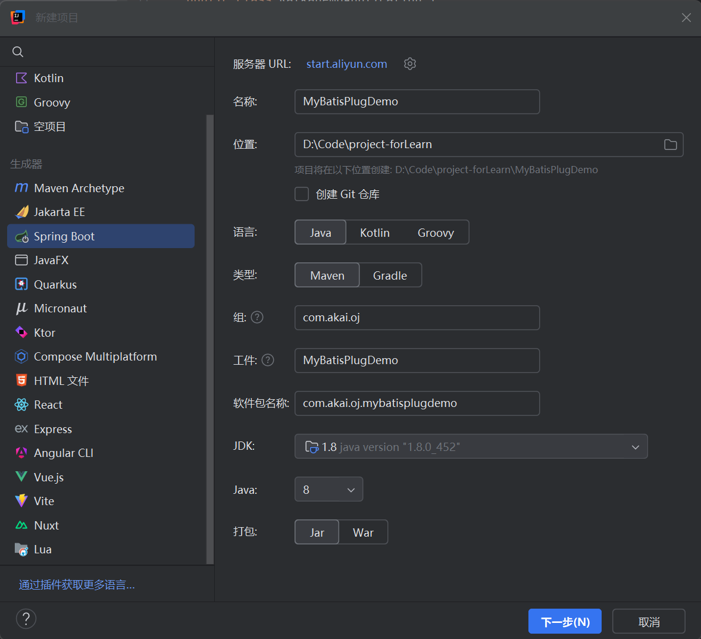
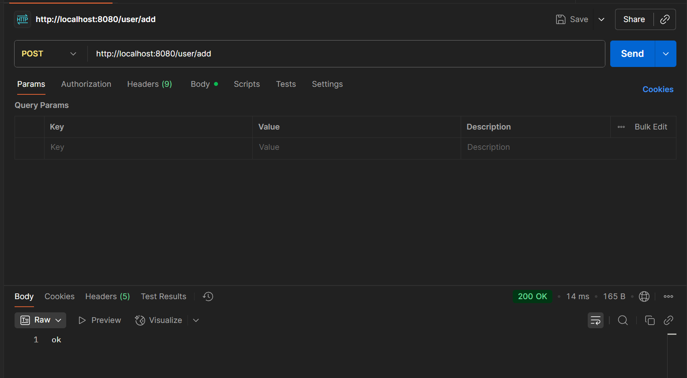
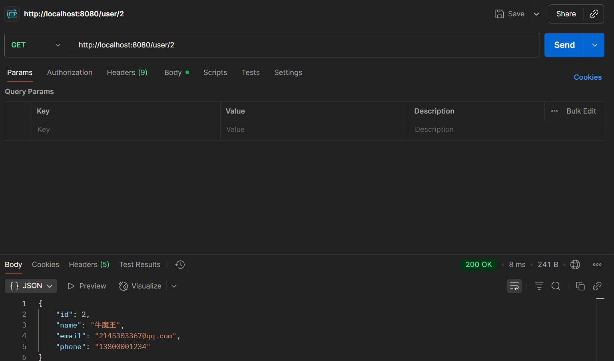

# 写个MyBatis插件

## 创建Demo项目



版本选择

|              组件               | 版本       |
| :-----------------------------: | ---------- |
|             **JDK**             | **1.8**    |
|         **Spring Boot**         | **2.7.18** |
| **MyBatis-Spring-Boot-Starter** | **2.3.1**  |
|         **Spring Web**          | **2.6.13** |

## 代码编写

项目结构

```
.
├── java
│   └── com.akai.mybatisplugdemo
│       ├── annotations
│       │   └── EncryptField
│       ├── config
│       │   └── MyBatisConfig
│       ├── controller
│       │   └── UserController
│       ├── Interceptor
│       │   └── EncryptInterceptor
│       ├── mapper
│       │   └── UserMapper
│       ├── model
│       │   └── User
│       ├── utils
│       │   └── AESUtil
│       └── MyBatisPlugDemoApplication
└── resources
    └── mapper
        └── userMapper.xml
```

加密注解

```java
@Target(ElementType.FIELD)
@Retention(RetentionPolicy.RUNTIME)
public @interface EncryptField {
}

```

拦截器

```java
@Intercepts({
        @Signature(type = ParameterHandler.class, method = "setParameters", args = PreparedStatement.class),
        @Signature(type = ResultSetHandler.class, method = "handleResultSets", args = Statement.class)
})
public class EncryptInterceptor implements Interceptor {

    @Override
    public Object intercept(Invocation invocation) throws Throwable {

        // 入库加密
        if (invocation.getTarget() instanceof ParameterHandler) {
            ParameterHandler handler = (ParameterHandler) invocation.getTarget();
            Object param = handler.getParameterObject();
            encryptObject(param);
        }

        // 出库解密
        if (invocation.getTarget() instanceof ResultSetHandler) {
            Object result = invocation.proceed();
            if (result instanceof List) {
                List list = (List) result;
                for (Object item : list) {
                    decryptObject(item);
                }
            }
            return result;
        }

        return invocation.proceed();
    }

    private void encryptObject(Object obj) throws Exception {
        if (obj == null) return;
        Class<?> clazz = obj.getClass();
        for (Field field : clazz.getDeclaredFields()) {
            if (field.isAnnotationPresent(EncryptField.class)) {
                field.setAccessible(true);
                Object value = field.get(obj);
                if (value instanceof String) {
                    field.set(obj, AESUtil.encrypt((String) value));
                }
            }
        }
    }

    private void decryptObject(Object obj) throws Exception {
        if (obj == null) return;
        Class<?> clazz = obj.getClass();
        for (Field field : clazz.getDeclaredFields()) {
            if (field.isAnnotationPresent(EncryptField.class)) {
                field.setAccessible(true);
                Object value = field.get(obj);
                if (value instanceof String) {
                    field.set(obj, AESUtil.decrypt((String) value));
                }
            }
        }
    }

    @Override
    public Object plugin(Object target) {
        return Plugin.wrap(target, this);
    }

    @Override
    public void setProperties(Properties properties) {
    }
}

```

mybatis配置类

```java
@Configuration
public class MyBatisConfig {

    @Bean
    public EncryptInterceptor encryptInterceptor() {
        return new EncryptInterceptor();
    }
}

```

加密工具类

```java
public class AESUtil {

    private static final String KEY = "1234567890123456";

    public static String encrypt(String value) {
        try {
            Cipher cipher = Cipher.getInstance("AES/ECB/PKCS5Padding");
            cipher.init(Cipher.ENCRYPT_MODE, new SecretKeySpec(KEY.getBytes(), "AES"));
            return Base64.getEncoder().encodeToString(cipher.doFinal(value.getBytes("UTF-8")));
        } catch (Exception e) {
            throw new RuntimeException(e);
        }
    }

    public static String decrypt(String value) {
        try {
            Cipher cipher = Cipher.getInstance("AES/ECB/PKCS5Padding");
            cipher.init(Cipher.DECRYPT_MODE, new SecretKeySpec(KEY.getBytes(), "AES"));
            return new String(cipher.doFinal(Base64.getDecoder().decode(value)), "UTF-8");
        } catch (Exception e) {
            throw new RuntimeException(e);
        }
    }
}

```

mapper类

```java
@Mapper
public interface UserMapper {

    void insert(User user);

    User selectById(Long id);
}

```

xml文件

```xml
<?xml version="1.0" encoding="UTF-8" ?>
<!DOCTYPE mapper
        PUBLIC "-//mybatis.org//DTD Mapper 3.0//EN"
        "http://mybatis.org/dtd/mybatis-3-mapper.dtd">

<mapper namespace="com.akai.mybatisplugdemo.mapper.UserMapper">

    <insert id="insert">
        INSERT INTO user (name, email, phone)
        VALUES (#{name}, #{email}, #{phone})
    </insert>

    <select id="selectById" resultType="com.akai.mybatisplugdemo.model.User">
        SELECT id, name, email, phone
        FROM user
        WHERE id = #{id}
    </select>

</mapper>

```

测试Controller

```java
@RestController
@RequestMapping("/user")
public class UserController {

    @Autowired
    private UserMapper userMapper;

    @PostMapping("/add")
    public String add() {
        User u = new User();
        u.setPhone("13800001234");
        u.setName("牛魔王");
        u.setEmail("250128418@qq.com");
        userMapper.insert(u);
        return "ok";
    }

    @GetMapping("/{id}")
    public User get(@PathVariable Long id) {
        return userMapper.selectById(id);
    }
}
```

测试实体类

```java
@With
@Builder
@Data
@NoArgsConstructor
@AllArgsConstructor

public class User {
    private Integer id;
    private String name;
    @EncryptField
    private String email;
    @EncryptField
    private String phone;
}
```

建表SQL

```SQL
SET NAMES utf8mb4;
SET FOREIGN_KEY_CHECKS = 0;

-- ----------------------------
-- Table structure for user
-- ----------------------------
DROP TABLE IF EXISTS `user`;
CREATE TABLE `user`  (
  `id` bigint NOT NULL AUTO_INCREMENT,
  `name` varchar(255) CHARACTER SET utf8mb4 COLLATE utf8mb4_0900_ai_ci NOT NULL,
  `email` varchar(255) CHARACTER SET utf8mb4 COLLATE utf8mb4_0900_ai_ci NOT NULL,
  `phone` varchar(255) CHARACTER SET utf8mb4 COLLATE utf8mb4_0900_ai_ci NOT NULL,
  PRIMARY KEY (`id`) USING BTREE
) ENGINE = InnoDB AUTO_INCREMENT = 2 CHARACTER SET = utf8mb4 COLLATE = utf8mb4_0900_ai_ci ROW_FORMAT = Dynamic;

SET FOREIGN_KEY_CHECKS = 1;
```
## PostMan测试
Post方法：

Get方法：注意这里查找2是因为已经测试过一次了



