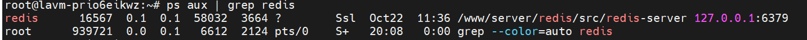
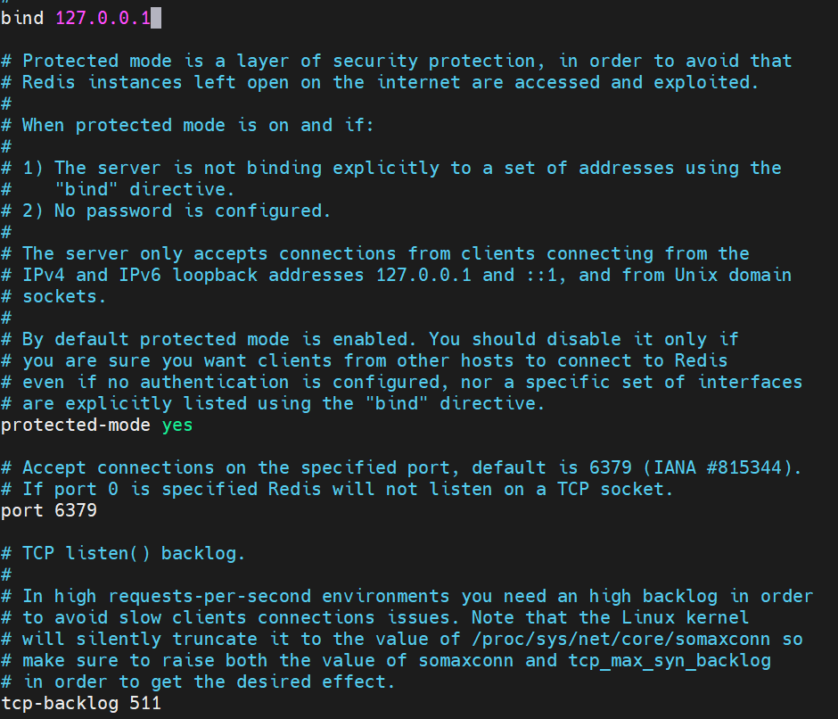

## MySQL打开远程连接设置
MySQL8.0+不显示`bind-address = 127.0.0.0`
- 找到服务器的MySQL配置文件`sudo nano /etc/my.cnf`
- 在`[mysqld]`中加入`bind-address = 0.0.0.0`
- 云服务器厂商安全组加入3306端口，防火墙放出3306端口
- 检查防火墙状态`sudo ufw status`
- 打开3306端口`sudo ufw allow 3306/tcp`
## Redis打开远程连接设置
- 用ps aux | grep redis查看redis启动服务的路径

- redis的安装路径就是`/www/server/redis/src/redis-server`打开Redis配置文件`sudo nano /www/server/redis/redis.conf`
* 将`bind 127.0.0.1`改为`bind 0.0.0.0`

* 找到`#requirepass foobared`，将注释去掉，foobared改为自己想要的密码