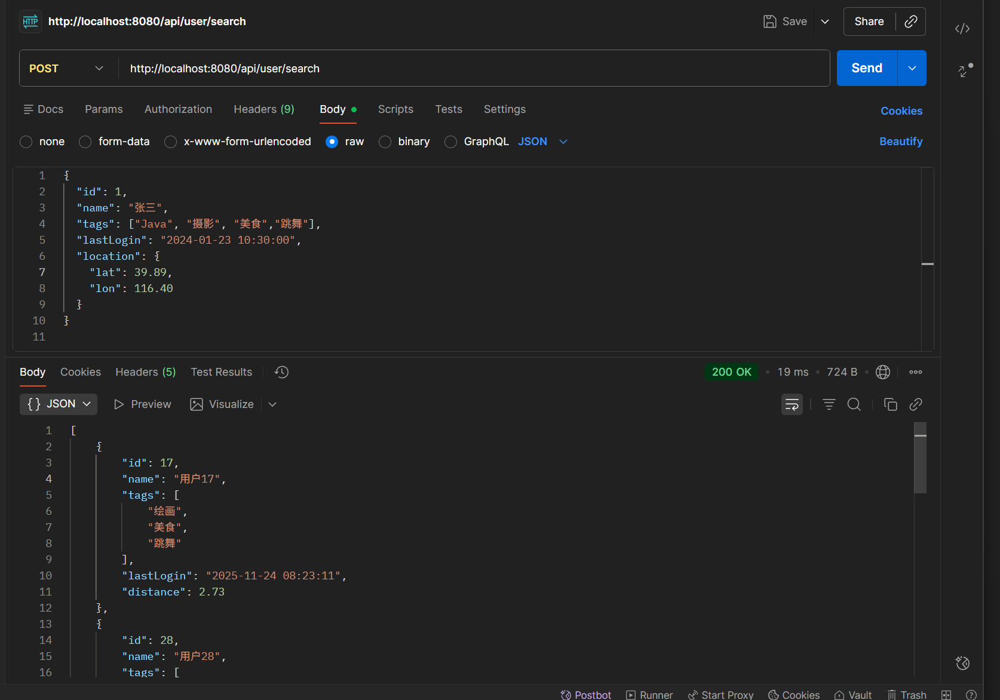

# 基于Redis+ES的高效LBS
## 实现思路
```aiignore
用户 → Redis GEO 筛选附近用户 → ES 排序（标签+距离+活跃时间） → 返回结果
```
标签相同个数按照从多到少排序，距离按照从近到远排序，活跃时间和当前时间的差
从小到大排序，主要目标对象还是附近的人所以先用Redis筛选附近的人
## 引入依赖

!!! warning
    ES版本是8.18.2

```xml
<dependencies>
        <dependency>
            <groupId>org.springframework.boot</groupId>
            <artifactId>spring-boot-starter-web</artifactId>
        </dependency>
        <!-- Spring Boot Redis Starter（默认 Lettuce 客户端）-->
        <dependency>
            <groupId>org.springframework.boot</groupId>
            <artifactId>spring-boot-starter-data-redis</artifactId>
        </dependency>


        <dependency>
            <groupId>org.projectlombok</groupId>
            <artifactId>lombok</artifactId>
            <optional>true</optional>
        </dependency>
        <!-- Elasticsearch Java API Client -->
        <dependency>
            <groupId>co.elastic.clients</groupId>
            <artifactId>elasticsearch-java</artifactId>
            <version>8.18.2</version>
        </dependency>

        <!-- 必须：transport 客户端 -->
        <dependency>
            <groupId>org.elasticsearch.client</groupId>
            <artifactId>elasticsearch-rest-client</artifactId>
            <version>8.18.2</version>
        </dependency>

        <!-- JSON 序列化（ES 官方默认使用 Jackson） -->
        <dependency>
            <groupId>com.fasterxml.jackson.core</groupId>
            <artifactId>jackson-databind</artifactId>
        </dependency>
        <dependency>
            <groupId>org.springframework.boot</groupId>
            <artifactId>spring-boot-starter-test</artifactId>
            <scope>test</scope>
        </dependency>
    </dependencies>
```

## 简单Web逻辑代码

实体类

```java
@Data
public class Location {
    private Double lat;
    private Double lon;
}

```

```java
@Data
public class User {
    private Long id;
    private String name;
    private List<String> tags;
    @JsonFormat(pattern = "yyyy-MM-dd HH:mm:ss", timezone = "Asia/Shanghai")
    private Date lastLogin;
    private Location location;
}
```

```java
@Data
public class UserVO {
    private Long id;
    private String name;
    private List<String> tags;
    @JsonFormat(pattern = "yyyy-MM-dd HH:mm:ss", timezone = "Asia/Shanghai")
    private Date lastLogin;
    private Double distance;
}
```

ES配置类

```java
@Configuration
public class ElasticsearchConfig {

    @Value("${elasticsearch.host:localhost}")
    private String host;

    @Value("${elasticsearch.port:9200}")
    private Integer port;

    @Value("${elasticsearch.username:}")
    private String username;

    @Value("${elasticsearch.password:}")
    private String password;

    @Bean
    public RestClient restClient() {
        RestClientBuilder builder = RestClient.builder(
                new HttpHost(host, port, "http")
        );

        // 如果配置了用户名和密码,则使用认证
        if (username != null && !username.isEmpty()) {
            CredentialsProvider credentialsProvider = new BasicCredentialsProvider();
            credentialsProvider.setCredentials(
                    AuthScope.ANY,
                    new UsernamePasswordCredentials(username, password)
            );

            builder.setHttpClientConfigCallback(httpClientBuilder ->
                    httpClientBuilder.setDefaultCredentialsProvider(credentialsProvider)
            );
        }

        return builder.build();
    }

    @Bean
    public ElasticsearchTransport elasticsearchTransport(RestClient restClient) {

        // ObjectMapper with JavaTimeModule
        ObjectMapper mapper = new ObjectMapper();
        mapper.registerModule(new JavaTimeModule());
        mapper.disable(SerializationFeature.WRITE_DATES_AS_TIMESTAMPS);

        // JacksonJsonpMapper 使用自定义的 ObjectMapper
        JacksonJsonpMapper jsonpMapper = new JacksonJsonpMapper(mapper);

        return new RestClientTransport(restClient, jsonpMapper);
    }


    @Bean
    public ElasticsearchClient elasticsearchClient(ElasticsearchTransport transport) {
        return new ElasticsearchClient(transport);
    }
}
```

Redis配置类

```java
@Configuration
public class RedisConfig {

    /**
     * RedisTemplate 配置
     */
    @Bean
    public RedisTemplate<String, Object> redisTemplate(RedisConnectionFactory redisConnectionFactory) {

        RedisTemplate<String, Object> template = new RedisTemplate<>();
        template.setConnectionFactory(redisConnectionFactory);

        // key 序列化
        StringRedisSerializer stringSerializer = new StringRedisSerializer();

        // value 序列化（JSON）
        GenericJackson2JsonRedisSerializer jsonSerializer = new GenericJackson2JsonRedisSerializer();

        // key & hash key
        template.setKeySerializer(stringSerializer);
        template.setHashKeySerializer(stringSerializer);

        // value & hash value
        template.setValueSerializer(jsonSerializer);
        template.setHashValueSerializer(jsonSerializer);

        template.afterPropertiesSet();
        return template;
    }

}
```

controller类

```java
@RestController
@RequestMapping("/user")
public class UserController {
    @Resource
    private ElasticsearchClient elasticsearchClient;
    @Resource
    private UserService userService;
    @GetMapping("/createIndex")
    public String createIndex() throws IOException {

        if (elasticsearchClient.indices().exists(e -> e.index("user")).value()) {
            return "索引 user 已存在";
        }
        TypeMapping mapping = new TypeMapping.Builder()
                .properties("id", new Property.Builder()
                        .long_(l -> l)
                        .build())

                .properties("name", new Property.Builder()
                        .keyword(k -> k)
                        .build())

                .properties("tags", new Property.Builder()
                        .keyword(k -> k)
                        .build())

                .properties("lastLogin", new Property.Builder()
                        .date(d -> d.format("yyyy-MM-dd HH:mm:ss||strict_date_optional_time"))
                        .build())

                .properties("location", new Property.Builder()
                        .geoPoint(g -> g)
                        .build())

                .build();

        CreateIndexRequest createIndexRequest = new CreateIndexRequest.Builder()
                .index("user")
                .mappings(mapping)
                .build();
        CreateIndexResponse createIndexResponse = elasticsearchClient.indices().create(createIndexRequest);
        return "user 索引创建成功";
    }


    /**
     * 初始化 50 条假数据（写入 Redis + ES）
     */
    @GetMapping("/init")
    public String init() throws IOException {
        userService.generateUsers();
        return "初始化数据成功";
    }
    @PostMapping("/search")
    public List<UserVO> query(@RequestBody User user){
        if(user==null){
            throw new RuntimeException("未登录");
        }
        if(user.getLocation()==null){
            throw new RuntimeException("未开启位置定位，无法使用");
        }
        return userService.searchUsers(user);
    }
}
```

service接口

```java
public interface UserService {
    public void generateUsers() throws IOException;

    List<UserVO> searchUsers(User user);
}
```

service实现类(ES实现使用的是低级客户端，高级客户端lambda一堆报错)

```java
@Service
public class UserServiceImpl implements UserService {
    @Resource
    private RedisTemplate<String, Object> redisTemplate;
    @Resource
    private ElasticsearchClient elasticsearchClient;
    @Resource
    private RestClient restClient;
    private static final String GEO_KEY = "user:geo";
    private static final List<String> TAG_POOL = Arrays.asList(
            "唱歌", "跳舞", "Java", "LOL", "绘画", "健身", "旅游", "摄影", "美食", "篮球","C++","Rust","Go","C"
    );
    private static final double R = 6371.0;
    @Override
    public void generateUsers() throws IOException {

        double baseLon = 116.403;
        double baseLat = 39.923;

        for (int i = 1; i <= 50; i++) {

            User user = new User();
            user.setId((long) i);
            user.setName("用户" + i);
            user.setLastLogin(new Date(System.currentTimeMillis() - new Random().nextInt(600) * 60 * 1000L));
            // 随机兴趣标签
            Collections.shuffle(TAG_POOL);
            user.setTags(TAG_POOL.subList(0, 3));

            // 随机坐标
            double lon = baseLon + (Math.random() - 0.5) * 0.04;
            double lat = baseLat + (Math.random() - 0.5) * 0.04;

            // 使用 Location 类来设置坐标（关键修改点）
            Location location = new Location();
            location.setLat(lat);
            location.setLon(lon);
            user.setLocation(location);

            //  Redis GEO 使用 lon + lat
            redisTemplate.opsForGeo().add(
                    GEO_KEY,
                    new Point(lon, lat),
                    user.getId().toString()
            );

            //  写入 ES（自动序列化为 { "lat": xx, "lon": xx }）
            elasticsearchClient.index(k -> k
                    .index("user")
                    .id(user.getId().toString())
                    .document(user)
            );
        }
    }

    @Override
    public List<UserVO> searchUsers(User requestUser) {

        double lat = requestUser.getLocation().getLat();
        double lon = requestUser.getLocation().getLon();
        List<String> tags = requestUser.getTags();

        if (tags == null || tags.isEmpty()) {
            throw new RuntimeException("请至少传入一个兴趣标签");
        }

        try {
            //1. Redis 查询附近用户（半径 5km）
            GeoResults<RedisGeoCommands.GeoLocation<Object>> nearby =
                    redisTemplate.opsForGeo().radius(
                            GEO_KEY,
                            new Circle(new Point(lon, lat), new Distance(5, Metrics.KILOMETERS)),
                            RedisGeoCommands.GeoRadiusCommandArgs.newGeoRadiusArgs().sortAscending()
                    );


            List<String> nearIds = nearby.getContent()
                    .stream()
                    .map(r -> r.getContent().getName().toString()) // ← 必须 toString
                    .collect(Collectors.toList());


            // 删除当前用户自身
            nearIds.remove(requestUser.getId().toString());

            // 附近没人直接返回空
            if (nearIds.isEmpty()) {
                return Collections.emptyList();
            }

            // 构造 terms id 过滤字段
            String filterIds = nearIds.stream()
                    .map(id -> "\"" + id + "\"")
                    .collect(Collectors.joining(","));

            // ========== 2. 构造 should (tags) ==========
            String shouldTags = tags.stream()
                    .map(t -> "{\"term\":{\"tags\":\"" + t + "\"}}")
                    .collect(Collectors.joining(","));

            // ========== 3. painless 参数 ==========
            String paramsTags = tags.stream()
                    .map(t -> "\"" + t + "\"")
                    .collect(Collectors.joining(","));

            // ========== 4. 当前时间（用于 lastLogin decay） ==========
            String nowStr = new SimpleDateFormat("yyyy-MM-dd HH:mm:ss").format(new Date());

            // ========== 5. ES 查询 JSON ==========
            String jsonQuery =
                    "{\n" +
                            "  \"size\": 5,\n" +
                            "  \"query\": {\n" +
                            "    \"bool\": {\n" +
                            "      \"filter\": {\n" +
                            "        \"terms\": { \"id\": [" + filterIds + "] }\n" +
                            "      },\n" +
                            "      \"must\": {\n" +
                            "        \"function_score\": {\n" +
                            "          \"query\": {\"bool\": {\"should\": [" + shouldTags + "], \"minimum_should_match\": 1}},\n" +
                            "          \"functions\": [\n" +
                            "            {\n" +
                            "              \"script_score\": {\n" +
                            "                \"script\": {\n" +
                            "                  \"source\": \"int s=0; for(tag in params.tags){ if(doc['tags'].contains(tag)){s++;}} return s;\",\n" +
                            "                  \"params\": {\"tags\": [" + paramsTags + "]}\n" +
                            "                }\n" +
                            "              },\n" +
                            "              \"weight\": 3\n" +
                            "            },\n" +
                            "            {\n" +
                            "              \"gauss\": {\"lastLogin\": {\"origin\": \"" + nowStr + "\", \"scale\": \"2h\", \"decay\": 0.5}},\n" +
                            "              \"weight\": 2\n" +
                            "            },\n" +
                            "            {\n" +
                            "              \"gauss\": {\"location\": {\"origin\": \"" + lat + "," + lon + "\", \"scale\": \"3km\", \"decay\": 0.5}},\n" +
                            "              \"weight\": 3\n" +
                            "            }\n" +
                            "          ],\n" +
                            "          \"score_mode\": \"sum\",\n" +
                            "          \"boost_mode\": \"sum\"\n" +
                            "        }\n" +
                            "      }\n" +
                            "    }\n" +
                            "  }\n" +
                            "}";

            // ========== 6. 调 ES ==========
            Request req = new Request("GET", "/user/_search");
            req.setJsonEntity(jsonQuery);

            Response response = restClient.performRequest(req);
            String json = EntityUtils.toString(response.getEntity(), "UTF-8");

            // ========== 7. 解析结果 ==========
            ObjectMapper mapper = new ObjectMapper();
            mapper.registerModule(new JavaTimeModule());
            mapper.disable(SerializationFeature.WRITE_DATES_AS_TIMESTAMPS);

            JsonNode hits = mapper.readTree(json).path("hits").path("hits");

            List<UserVO> result = new ArrayList<>();

            for (JsonNode hit : hits) {
                User u = mapper.treeToValue(hit.path("_source"), User.class);
                UserVO vo = new UserVO();
                BeanUtils.copyProperties(u, vo);

                // 计算真实距离（2位小数）
                double dist = calculateDistance(lat, lon,
                        u.getLocation().getLat(), u.getLocation().getLon());

                vo.setDistance(dist);
                result.add(vo);
            }

            return result;

        } catch (Exception e) {
            throw new RuntimeException("搜索失败：" + e.getMessage(), e);
        }
    }

    private double calculateDistance(double lat1, double lon1, double lat2, double lon2) {
         // 地球半径 km

        double dLat = Math.toRadians(lat2 - lat1);
        double dLon = Math.toRadians(lon2 - lon1);

        lat1 = Math.toRadians(lat1);
        lat2 = Math.toRadians(lat2);

        double a = Math.sin(dLat / 2) * Math.sin(dLat / 2)
                + Math.cos(lat1) * Math.cos(lat2)
                * Math.sin(dLon / 2) * Math.sin(dLon / 2);

        double c = 2 * Math.atan2(Math.sqrt(a), Math.sqrt(1 - a));
        double distance = R * c;
        return new BigDecimal(distance)
                .setScale(2, RoundingMode.HALF_UP)
                .doubleValue();
    }
}
```

yml配置(ES未开始HTTPS)

```yml
server:
  port: 8080
  servlet:
    context-path: /api
spring:
  redis:
    host: localhost
    port: 6379
elasticsearch:
  host: localhost
  port: 9200
```

## Postman测试

GET

```GET
http://localhost:8080/api/user/createIndex
```

GET

```
http://localhost:8080/api/user/init
```

POST

```
http://localhost:8080/api/user/search
```

POST方法的body

```json
{
  "id": 1,
  "name": "张三",
  "tags": ["Java", "摄影", "美食","跳舞"],
  "lastLogin": "2024-01-23 10:30:00",
  "location": {
    "lat": 39.89,
    "lon": 116.40
  }
}
```

测试结果结果：


