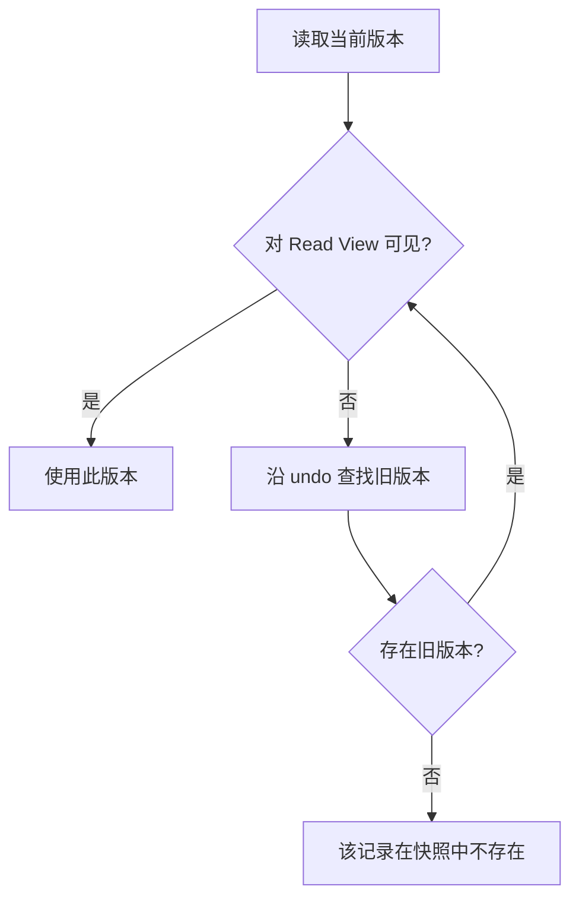
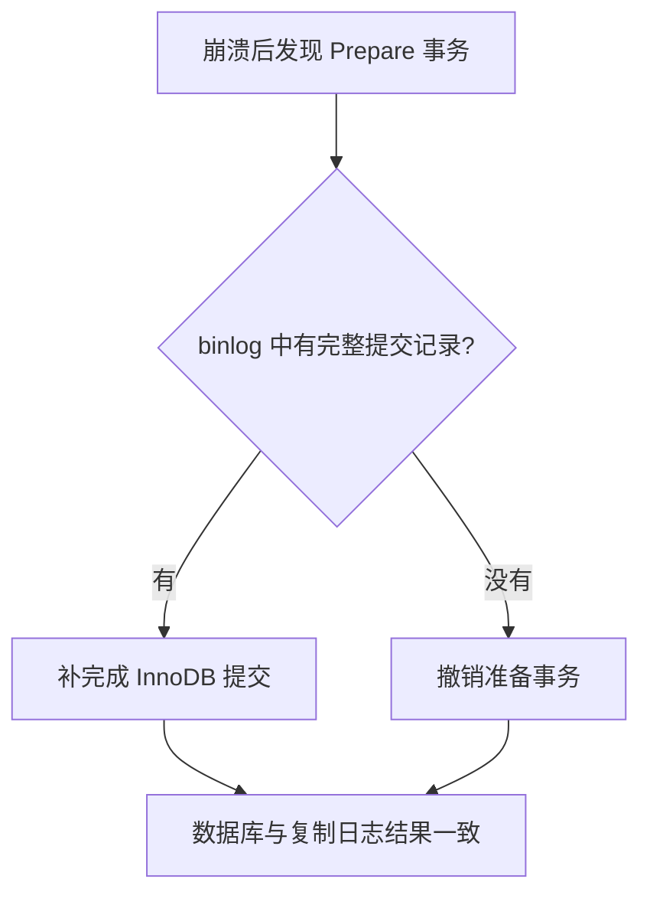

# MySQL 面试知识与追问详解：从数据类型到索引、事务、锁与日志

MySQL 面试通常从字段类型和 SQL 基础开始，再深入索引、事务、锁与日志。本文按主题整理 14 个基础问题（B01—B14）和 49 个高级问题（A01—A49），并补充连接池、主键选择、索引结构、日志恢复和复制等常见追问，结合 SQL 示例解释相关机制。

<!-- more -->

::: info 适用范围

以 **MySQL 8.0 / 8.4、InnoDB** 为主。涉及旧版本、其他存储引擎或特定隔离级别时单独说明。

:::

**阅读导航**

- [一、字段类型与数据库对象](#data-types-and-objects)
- [二、SQL 执行与存储引擎](#sql-and-storage-engines)
- [三、索引与查询优化](#indexes-and-query-optimization)
- [四、事务与 MVCC](#transactions-and-mvcc)
- [五、锁与并发控制](#locks-and-concurrency)
- [六、日志、持久性与两阶段提交](#logs-and-two-phase-commit)
- [七、慢查询与分页](#slow-queries-and-pagination)
- [八、分库分表与复制](#sharding-and-replication)
- [九、容易记错的结论](#common-misconceptions)
- [十、参考资料](#references)

## 一、字段类型与数据库对象 {#data-types-and-objects}

### B01：UNSIGNED 改变了什么？

`UNSIGNED` 表示无符号整数：不用一半的取值空间表示负数，正数上限因此增大，但存储字节数不变。

| 类型      | 有符号范围      | 无符号范围   | 大小   |
| ------- | ---------- | ------- | ---- |
| TINYINT | -128～127   | 0～255   | 1 字节 |
| INT     | -2³¹～2³¹-1 | 0～2³²-1 | 4 字节 |
| BIGINT  | -2⁶³～2⁶³-1 | 0～2⁶⁴-1 | 8 字节 |

非负计数、部分 ID 可以使用无符号整数，但需要考虑程序语言的映射：例如 Java 的 `long` 是有符号类型，不能直接覆盖 `BIGINT UNSIGNED` 的全部范围。不要仅因为“不存负数”就忽略应用端兼容性。

### B02：如何选择 CHAR 和 VARCHAR？

`CHAR(M)` 适合长度固定或接近固定的字符数据；`VARCHAR(M)` 存储变长字符串。这里的 `M` 是字符数上限，不是字节数。

`VARCHAR` 通常需要额外的 1 或 2 字节记录长度，具体取决于允许的最大字节长度。`CHAR` 有填充及尾部空格处理规则；字符串比较还受排序规则影响，不能简单理解成逐字节比较。

例如，固定格式的编码可以考虑 `CHAR`，昵称、标题通常用 `VARCHAR`。二进制摘要可使用 `BINARY` 或 `VARBINARY`，不必先转成十六进制字符串。MD5 是哈希算法，不是密码加密方案；密码应使用专门的密码哈希算法。

### B03：VARCHAR 长度与 INT 括号中的数字分别表示什么？

`VARCHAR(10)` 与 `VARCHAR(100)` 的主要差异是最大允许字符数。存储同样的短字符串时，数据主体大小相同，但长度前缀是否跨过字节阈值、字符集和行格式都可能影响总开销。

字段声明得过长，可能影响索引长度限制、某些临时表和内存操作的成本。不过不能说“所有内存操作都固定按声明上限分配”；具体要看版本与执行算法。

#### 追问：`INT(1)` 与 `INT(10)` 有什么差别？

旧版本中括号里的数字是显示宽度，不是存储长度，也不是数值位数限制。两者都是 4 字节，取值范围相同。MySQL 8.0 已弃用整数显示宽度，不应靠它限制数据范围。

### B04：金额为什么通常用 DECIMAL？

`DECIMAL(p,s)` 是精确的十进制定点类型，`p` 表示总位数，`s` 表示小数位数。`FLOAT`、`DOUBLE` 是二进制浮点数，很多十进制小数只能近似表示。

```sql
CREATE TABLE payments (
    id BIGINT PRIMARY KEY,
    amount DECIMAL(12, 2) NOT NULL
);
```

金额可使用 `DECIMAL`，也可按最小货币单位使用整数。Java 常对应 `BigDecimal`，Python 常对应 `Decimal`。计算链路也要保持精度，不能先用浮点数算完再转回精确类型。

### B05：TEXT 和 BLOB 应该避免吗？

不是不能用，而是应避免把大型内容塞进频繁访问的核心记录中。

- `TEXT` 用于文本，受字符集与排序规则影响。
- `BLOB` 用于二进制内容。
- 大字段可能增加页外读取、网络传输、备份及临时处理成本；具体存储位置取决于大小和行格式。

文章正文可以存 `TEXT`；大文件通常更适合对象存储，数据库保存路径和元数据。热点字段与大字段分表也是常见方式。查询时选择必要列，避免习惯性 `SELECT *`。

### B06：DATETIME 与 TIMESTAMP 的区别是什么？

| 项目       | DATETIME     | TIMESTAMP                  |
| -------- | ------------ | -------------------------- |
| 时间语义     | 保存提供的日期时间字面值 | 按会话时区转换成 UTC 存储，读取时转换回会话时区 |
| 常见取值范围   | 1000～9999 年  | 1970 年附近～2038 年            |
| 现代格式基础存储 | 5 字节         | 4 字节                       |
| 小数秒精度    | 支持，额外占用空间    | 支持，额外占用空间                  |

“DATETIME 一定占 8 字节”是旧格式结论。现代格式从 MySQL 5.6.4 起发生变化。[参考：数据类型存储要求](https://dev.mysql.com/doc/refman/8.4/en/storage-requirements.html)。

如果用 `DATETIME` 保存绝对时间，应用应统一约定 UTC；否则一个没有时区标记的时间很容易被错误解释。生日、门店当地营业时间等，可能更适合保留当地日期或时间语义。

### B07：NULL 与空字符串有什么差别？

`NULL` 表示缺失或未知，`''` 表示已知的空字符串。

```sql
SELECT NULL = NULL;     -- NULL
SELECT '' = '';         -- 1
SELECT * FROM users WHERE nickname IS NULL;
```

比较 `NULL` 应使用 `IS NULL`，不能写 `= NULL`。`COUNT(*)` 统计行数，`COUNT(column)` 忽略该列为 `NULL` 的行。多数聚合函数也忽略 `NULL`。

`DISTINCT`、`GROUP BY` 会按各自规则处理多个 `NULL`，这不代表普通等号比较认为它们相等。

### B08：BOOLEAN 是否只允许 0 和 1？

MySQL 的 `BOOL`、`BOOLEAN` 是 `TINYINT(1)` 的别名。零通常解释为假，非零解释为真，但类型本身不限制只能存 0 或 1。

```sql
CREATE TABLE switches (
    id BIGINT PRIMARY KEY,
    enabled BOOLEAN NOT NULL,
    CHECK (enabled IN (0, 1))
);
```

需要严格限定取值时，可以使用实际执行 CHECK 约束的版本；MySQL 从 8.0.16 起执行 CHECK。应用也应校验输入。[参考：数值类型语法](https://dev.mysql.com/doc/refman/8.4/en/numeric-type-syntax.html)。

### B09：电话号码该用什么类型？

电话号码是标识符，通常使用 `VARCHAR`，不是用来做算术的整数。字符串能保留前导零、国际区号及其他格式信息。

实际系统通常将号码规范化后存储，并明确是否保留展示格式。加密、脱敏和访问权限由业务安全要求决定；如果使用随机化加密，普通前缀索引也无法直接搜索明文号段，需要单独设计检索方案。

### B10：ACID 是什么？

| 特性    | 含义                 | InnoDB 中的主要机制          |
| ----- | ------------------ | ---------------------- |
| 原子性 A | 事务的修改整体成功或整体撤销     | undo、事务回滚              |
| 一致性 C | 事务遵守数据库约束和业务不变量    | 约束、正确的事务逻辑以及其他事务特性共同保障 |
| 隔离性 I | 并发操作遵守选定隔离级别的可见性规则 | 锁、MVCC                 |
| 持久性 D | 成功提交的修改可以在故障后恢复    | redo、可靠刷盘及存储系统         |

一致性不是“数据库自动理解所有业务规则”。例如转账总额不变，仍需要业务代码正确地扣款、入账，并放在合适的事务边界内。实现细节见 [A23：ACID 在 InnoDB 中如何落地？](#acid-in-innodb)。

### B11：视图是什么，有哪些利弊？

普通视图主要保存查询定义，不是预先保存一份独立结果集。

```sql
CREATE VIEW public_users AS
SELECT id, nickname FROM users;
```

它可以复用查询逻辑、隐藏字段、提供稳定接口。配合恰当权限设置，可以让调用者通过视图访问有限的数据。

不足包括：复杂或多层嵌套视图难以维护；不一定提升性能；基表结构变更可能影响视图。部分简单视图可更新，但聚合、某些连接等视图不能任意更新。对可更新视图的修改，会作用于基表。

### B12：存储过程适合解决什么问题？

存储过程在数据库内封装 SQL 与流程控制，可以减少应用与数据库之间的多次往返，集中执行某些数据处理流程。

代价是数据库与业务逻辑耦合加深、调试和测试较困难、跨数据库迁移成本较高。不应把“存储过程”等同于“永远预编译、执行计划永久不变、必然比应用代码快”。是否采用应结合运维能力和实际测量。

### B13：系统变量、用户变量、流程控制和游标分别是什么？

| 名称        | 用途                          |
| --------- | --------------------------- |
| 全局系统变量    | 服务器级配置，部分可动态修改              |
| 会话系统变量    | 当前连接的行为设置                   |
| 用户变量 `@x` | 当前会话保存的用户数据                 |
| 局部变量      | 存储程序中通过 `DECLARE` 定义，作用于语句块 |

```sql
SELECT @@session.transaction_isolation;
SET @page_size = 20;
```

存储程序可以使用 `IF`、`CASE`、`LOOP`、`WHILE`、`REPEAT` 等流程控制。

游标用来逐行读取结果，典型过程为声明、打开、FETCH、关闭。MySQL 存储程序游标是只读、非滚动的，不能把它描述成可以任意前后移动的通用指针。能够使用集合 SQL 完成的工作，优先用集合操作，避免无必要的逐行处理。

### B14：触发器有什么作用，后端开发要不要大量使用？

触发器会在某类数据变更前后自动执行逻辑，可用于数据库层校验、审计或维护关联数据。

但它的执行是隐式的，复杂逻辑容易造成调试困难、锁竞争、批量写入变慢和迁移成本增加。对 InnoDB 的事务性表，触发器失败可能让相关语句回滚；混用非事务性表时不能直接套用相同保证。

一般业务逻辑优先放应用服务层，简单约束优先考虑 `NOT NULL`、`UNIQUE`、外键和 CHECK。只有明确需要所有写入入口都执行某种数据库逻辑时，再考虑触发器，并做好版本管理与测试。

### 追问：UNIQUE 是什么字段类型？

`UNIQUE` 是唯一约束，不是数据类型。它通过唯一索引约束重复值，既检查插入，也检查更新。

```sql
CREATE TABLE users (
    id BIGINT PRIMARY KEY AUTO_INCREMENT,
    email VARCHAR(255) NOT NULL UNIQUE,
    nickname VARCHAR(50)
);
```

MySQL 唯一索引通常允许多个 `NULL`；联合唯一索引如果包含 `NULL`，也不能直接理解成普通非空组合的唯一性检查。需要禁止空值时加 `NOT NULL`。

一张表可以有多个唯一约束，但只有一个主键。字符串是否重复还由排序规则决定：不区分大小写的排序规则下，`Alice` 和 `alice` 可能被视为相等。

## 二、SQL 执行与存储引擎 {#sql-and-storage-engines}

### A01：SQL 的逻辑处理顺序是什么？

理解查询语义时，可以按下面的顺序思考：

1. `FROM` / `JOIN`：产生数据来源并处理连接。
2. `WHERE`：过滤行。
3. `GROUP BY`：分组。
4. `HAVING`：过滤分组。
5. `SELECT`：计算输出表达式。
6. `DISTINCT`：去重。
7. `ORDER BY`：排序。
8. `LIMIT`：限制返回范围。

这是逻辑处理模型，不是执行器必须逐步照做的物理顺序。优化器可能提前过滤、调整连接顺序，或利用索引避免排序。

#### 追问：INNER JOIN 与 LEFT JOIN 的区别？

`INNER JOIN` 只保留匹配成功的记录；`LEFT JOIN` 保留左表全部记录，右侧无匹配时补 `NULL`。

```sql
SELECT u.id, o.id AS order_id
FROM users AS u
LEFT JOIN orders AS o
  ON o.user_id = u.id AND o.status = 'paid';
```

这里保留没有已支付订单的用户。如果把 `o.status = 'paid'` 放到 `WHERE`，补出的 `NULL` 行会被过滤，结果通常失去保留这些用户的效果。

### A02：MySQL 可以实现可重入锁吗？

单个 MySQL 实例内，可以使用基于连接的命名锁 `GET_LOCK()`。同一连接可以重复获取同名锁，释放时需要匹配获取次数。

```sql
SELECT GET_LOCK('job:daily-report', 5);
SELECT GET_LOCK('job:daily-report', 5);
SELECT RELEASE_LOCK('job:daily-report');
SELECT RELEASE_LOCK('job:daily-report');
```

返回值需要检查：不能把获取失败或超时当成成功。此类锁是协作式的，只有遵守同一命名锁协议的参与者才受约束，并不会自动锁住业务表记录。

锁属于连接，`COMMIT` / `ROLLBACK` 不会自动释放它。使用连接池时，需要在归还连接前显式释放，避免下一位借用者继承锁。它也不是跨多台独立 MySQL 实例的分布式锁。[参考：命名锁函数](https://dev.mysql.com/doc/refman/8.4/en/locking-functions.html)。

### A03：一条 SQL 从客户端到结果返回经历什么？

主要环节是：建立或复用连接、认证与权限检查、解析 SQL、预处理、优化、执行、返回结果。

解析器识别词法和语法；预处理阶段处理对象解析等问题；优化器选择索引、连接顺序和其他访问方式；执行器调用存储引擎接口读取和修改数据。

#### 追问：存储引擎先返回 Server 层，再返回客户端吗？

可以这样理解。存储引擎提供记录访问能力，Server 层执行器继续完成过滤、连接、聚合等工作，并通过协议向客户端发送结果。但不是所有查询都必须等“完整结果集先存好”再返回，很多执行过程可以逐步读取和输出。

MySQL 8.0 已移除 Query Cache。Buffer Pool 仍然存在：它缓存数据页和索引页，不是缓存整条 SQL 的结果，两者不要混淆。

#### 追问：连接池有什么用？

连接池复用已有连接，减少 TCP 建连、认证和会话初始化的成本；限制并发连接数；管理空闲回收、有效性检查和获取连接时的等待。

池不是越大越好。若多个应用实例各开 100 个连接，总连接数会叠加。应用生命周期内通常创建并复用连接池，关闭应用时释放；每次业务操作借用连接，完成后归还。事务、会话设置和命名锁等状态也需要正确清理。

### A04：MySQL 的存储引擎负责什么？

存储引擎负责底层数据存储与访问，不同引擎具有不同的索引、锁和事务能力。Server 层的 SQL 解析、优化等能力可以与多种引擎协作。

常见引擎包括 InnoDB、MyISAM、MEMORY、NDB 等。实际业务系统讨论事务、行锁、redo、undo、MVCC 时，通常指 InnoDB，不能把这些机制直接套到所有引擎上。

### A05：InnoDB 与 MyISAM 的主要差异是什么？

| 维度    | InnoDB    | MyISAM     |
| ----- | --------- | ---------- |
| 事务    | 支持        | 不支持事务回滚    |
| 常见锁粒度 | 行级锁及相关表级锁 | 表级锁        |
| 数据组织  | 按聚簇索引组织   | 数据与索引分离    |
| 崩溃处理  | 有事务日志恢复机制 | 可能需要检查与修复表 |
| 外键    | 支持        | 不支持        |

#### 追问：MyISAM 读取一定更快吗？

不一定。历史上某些只读场景受益于较简单的结构；无条件 `COUNT(*)` 等情况也有实现差异。但真实性能受查询、缓存、索引和并发影响。现代事务业务通常优先 InnoDB，不能仅凭“读多写少”就断定应选 MyISAM。

### A06：聚簇索引与非聚簇索引如何区分？

InnoDB 聚簇索引的叶子页保存完整行记录。二级索引叶子记录保存索引字段以及用于定位行的主键值。

```sql
SELECT nickname FROM users WHERE email = 'a@example.com';
```

如果 `email` 二级索引不包含 `nickname`，先查 email 索引取得主键，再查聚簇索引取得昵称，这就是回表。


图中的两棵树分别按 email 和主键 id 排序。二级索引提供主键定位信息，聚簇索引叶子提供完整行记录；树形与页内记录均为教学简图。

MyISAM 索引中的定位信息指向独立数据文件中的记录位置。注意 InnoDB 不是“所有索引都是聚簇索引”，它也有二级索引。

### A07：三层 B+ 树大约能保存多少条记录？

必须先声明页大小、键长度、指针开销和行大小。假设：

- 页大小 16 KiB。
- 内部页每个“键＋子页指针”粗略占 14 字节。
- 叶子页每条完整记录粗略占 1 KiB。

忽略页头、目录、填充率等开销，内部页扇出约 `16384 / 14 ≈ 1170`，叶子页约放 16 行。根、内部层、叶子层共三层时，容量约为：

`1170 × 1170 × 16 ≈ 2190 万行`。

这是数量级估算，不是容量承诺。行更宽或主键更长，容量会下降；二级索引叶子不存完整行，容量估算也不同。树高也不等于每次查询必然发生同样次数的磁盘 I/O，因为上层页可能已在缓存中。

## 三、索引与查询优化 {#indexes-and-query-optimization}

### A08：索引带来什么收益和成本？

索引是维护特定字段检索结构的数据组织方式，可以加速定位、范围扫描、连接和某些排序或分组操作，也可以实施唯一性约束。

成本包括存储空间、缓存占用，以及写入时维护索引的开销。索引不是越多越好，更新索引列、插入和删除都可能涉及多个索引页。

### A09：索引有哪些分类？没有主键时怎么办？

可以从不同维度分类：

| 维度 | 常见分类 |
| ---- | ---- |
| 数据结构与检索方式 | B+ 树、Hash、全文索引、空间索引 |
| 物理存储与组织形式 | 聚簇索引、二级索引（辅助索引） |
| 字段特性与建索引方式 | 主键索引、唯一索引、普通索引、前缀索引 |
| 字段数量 | 单列索引、联合索引 |

这些分类并不互斥。例如一个索引可以同时是联合、唯一、二级索引。

这里的“字段特性”是面试中常用的归类口径：主键与唯一涉及约束，前缀索引则表示只索引字符串的前一部分，可以与普通或唯一索引组合。全文索引通常基于倒排结构；它与 B+ 树、Hash 并非完全相同层次的结构概念。InnoDB 常规索引使用 B+ 树，能否创建其他索引类型还取决于存储引擎。

#### 追问：哈希索引与全文索引有什么区别？

哈希适合等值查找，通常不支持利用顺序进行范围和排序。InnoDB 的自适应哈希索引是内部优化机制，不能等同于用户随意创建的 HASH 索引。全文索引面向词项检索，与 `LIKE '%word%'` 的字符子串匹配语义不同。空间索引则处理地理或几何对象。

#### 追问：表没有显式主键怎么办？

InnoDB 优先使用主键作为聚簇索引；没有主键时，寻找所有列均为 `NOT NULL` 的合适唯一索引；仍没有时，创建包含隐藏行 ID 的聚簇索引。业务表通常应显式设计稳定主键。

#### 追问：回表是什么？

二级索引查到主键后，再访问聚簇索引读取所需字段。只有需要的字段不在二级索引中时，才需要这一步。二级索引自带主键，因此主键字段可以参与覆盖查询。

### A10：联合索引为什么遵循最左前缀？

索引 `(a,b,c)` 先按 `a` 排序，`a` 相同再按 `b` 排序，`a、b` 相同再按 `c` 排序。已知左侧字段，才能把后续字段对应的值定位到较连续的范围。


三个面板使用同一组有序索引键：左侧条件能形成连续范围，只给 b 则可能分散在不同 a 的区间内。图中比较的是普通最左前缀定位，不能据此断言其他访问方案一定不会使用该索引。

| 条件            | 常见效果                         |
| ------------- | ---------------------------- |
| `a=1`         | 可以利用左侧前缀定位                   |
| `a=1 AND b=2` | 可以利用 `(a,b)` 定位              |
| `b=2 AND a=1` | 和上一行语义相同，WHERE 书写顺序不影响       |
| `a=1 AND c=3` | 通常先用 a 定位，c 用于进一步过滤          |
| `b=2`         | 通常无法按普通最左前缀定位，可能使用其他方案       |
| `a>1 AND b=2` | a 提供主要范围，b 是否参与边界构造要看具体条件与计划 |

不能死记“遇到范围后，后面的字段完全失效”。后续字段仍可能用于索引内过滤、ICP、覆盖查询；某些范围条件还能参与边界构造。MySQL 8.0 的 Skip Scan 在特定条件下也能跳过缺失的前导列。

### A11：主键怎样选？自增、UUID 和雪花 ID 各有什么代价？

主键通常希望短、唯一、稳定、非空，并尽量减少无序插入带来的页分裂。不要随意使用会频繁变化的业务字段作为主键。

#### 追问：分布式场景为什么常不直接用各库自增？

各分片独立自增会产生重复 ID，合并和迁移时也可能冲突。主要问题是全局唯一性与协调，不能说“使用自增就一定有单点故障”；是否存在单点取决于架构。自增同样可以通过分配不同步长和偏移等方式实现特定场景的唯一性。

#### 追问：UUID 可以作为主键吗？

可以。`BINARY(16)` 比 36 字符的文本表示紧凑。但随机 UUID 会造成分散写入，可能增加页分裂与缓存压力；较长主键还会放大所有二级索引。具有时间顺序的 UUID 方案能缓解一部分问题，不能把所有 UUID 都当成完全随机。

#### 追问：雪花算法怎么组成？

经典形式在 64 位中使用 1 位符号、41 位时间、10 位节点标识、12 位毫秒内序号，具体实现可以调整。12 位对应每个节点每毫秒最多 4096 个序号，不是整个系统的总上限。时间以自定义纪元为起点，并非必须从 1970 年算起。

优点是生成时无需每次访问数据库、总体随时间增长；代价是节点 ID 分配和时钟回拨处理。回拨时可等待、拒绝生成或使用经过验证的逻辑时钟策略，不能随便“重置序号”来声称解决重复问题。

### A12：性别这种低基数字段适合索引吗？

不能只看字段有几种值，还要看实际分布与查询。如果某个值覆盖一半记录，二级索引扫描加大量回表可能不划算；如果某个值极少，或索引覆盖查询所需列，仍可能有收益。

低基数字段也可能作为联合索引的一部分，例如 `(status, created_at)` 服务某状态下的时间排序。是否有效，应依据真实数据和执行计划。

### A13：InnoDB 的索引如何组织？

常规索引使用 B+ 树组织成页。内部页负责导航，叶子页保存记录；聚簇索引叶子存整行，二级索引叶子存索引键和主键定位信息。

数据页通过 Buffer Pool 缓存，访问索引并不意味着每次都读磁盘。FULLTEXT、空间索引等具有专门结构，不应套用普通 B+ 树全部结论。

### A14：B+ 树有哪些关键性质？

它是平衡的多路搜索树，内部节点容纳多个分隔键和子节点指针；叶子处于相同深度。用于导航的内部节点不保存完整业务行，因此扇出通常较大、树高较低。

InnoDB 同层页有链接，叶子按键顺序组织，有利于顺序范围访问。插入和删除需要维护页及树结构，可能引发分裂或合并。

### A15：B 树与 B+ 树有什么差别？

典型 B 树的内部节点也可保存数据条目，查找可能在内部节点结束；B+ 树将实际记录集中在叶子，内部层主要导航。


图中键 20 在 B 树的内部节点保存记录，在 B+ 树的内部节点只作为导航键，实际记录仍在叶子。示意用于对比结构，不表示 InnoDB 页内布局。

B+ 树内部节点能容纳更多键，常具有较低高度；叶子顺序访问方便范围扫描。不能只凭名称断言某个产品的具体实现，数据库文档中的“B-tree”有时是一个较宽泛的类别名。

### A16：为什么磁盘数据库常用 B+ 树，而不是二叉树、哈希或跳表？

磁盘访问常以页为单位。B+ 树将多个键放到一个页中，提高扇出，减少导航时需要访问的页数，同时支持等值、范围和顺序访问。

平衡二叉树扇出小，大数据量下层数较深；哈希不便进行有序范围检索。跳表在内存系统中很实用，但指针跳转和节点布局不天然适合数据库的页式存储。可以设计页化跳表，不能说它“理论上不能用于磁盘”；这里只是工程选择上的差异。

### A17：覆盖索引和索引下推分别减少什么？

**覆盖索引**：所需字段已在索引中，不必为获取这些字段回表。覆盖是某个索引相对于某条查询的性质，不是独立的索引类型，也不要求一定是联合索引。

**ICP（索引条件下推）**：存储引擎先利用索引中的值判断可下推条件，过滤掉不符合条件的记录，再回表读取剩余记录。InnoDB 的 ICP 用于二级索引，常见适用访问方式包括 `range`、`ref` 等，还受表达式和索引类型限制。

```sql
CREATE INDEX idx_name_age ON users(name, age);

SELECT * FROM users
WHERE name LIKE '张%' AND age = 20;
```

假设计划用 name 前缀扫描，age 可以在二级索引中判断。没有 ICP 时可能先回表再判断 age；使用 ICP 时可先排除年龄不符合的记录。是否实际启用看执行计划。


图中假设扫描 5 条、筛出 3 条，数字用于说明路径，并非性能实测。ICP 先过滤以减少回表；覆盖查询所需字段已在索引内，不必回表获取这些字段。图中的覆盖查询选择 id、name、age，id 由 InnoDB 二级索引的主键定位信息提供。

#### 追问：ICP 只适用于联合索引吗？

不是。单列二级索引也可能提供可用于进一步过滤的索引值。例如 `name LIKE '张%' AND name LIKE '%明'`，前者定位范围，后者有机会在索引中判断。

#### 追问：这是把 Server 条件传给存储引擎吗？

是把符合下推条件的那部分表达式交给引擎，利用索引值在读取完整行前评估；不是把任意业务条件全部搬到引擎。`EXPLAIN` 中 `Using index condition` 表示 ICP，`Using index` 通常表示覆盖访问，两者不同。[参考：ICP](https://dev.mysql.com/doc/refman/8.4/en/index-condition-pushdown-optimization.html)。

### A18：单列索引与联合索引都能用时，选哪一个？

优化器按成本估算选择，不是固定“优先单列”或“优先联合”。它会考虑扫描量、回表、排序、覆盖、索引宽度与统计信息等。

例如查询 name 并输出 age，`(name,age)` 可能具有覆盖优势；只按 name 查少量行，较窄的 name 索引也可能更便宜。如果联合索引已服务单列查询，不代表单列索引一定应立即删除；要评估其他查询与写入负担。

### A19：排序、filesort、单路和双路分别是什么意思？

如果索引顺序能够满足 `ORDER BY`，可能直接按索引顺序读取；否则需要额外排序，执行计划常显示 `Using filesort`。这个名称不意味着一定写磁盘，小结果可以在内存排序。

| 教学称呼 | 排序时保存的内容     | 排序后的操作        |
| ---- | ------------ | ------------- |
| 双路排序 | 排序键＋行定位信息    | 按定位信息再次读取所需列  |
| 单路排序 | 排序键＋查询所需的附加列 | 直接利用已保存的列产生结果 |

选择取决于元组大小、算法和版本。现代版本不能再直接用旧版 `max_length_for_sort_data` 阈值口诀判断。排序可能分块、写临时文件并合并；`sort_buffer_size` 也不是整个实例唯一的一块共享排序内存。[参考：ORDER BY 优化](https://dev.mysql.com/doc/refman/8.4/en/order-by-optimization.html)。

### A20：怎样决定应该建立哪些索引？

从高频、耗时和重要查询出发，检查过滤、连接和排序组合，而不是给每列都建索引。

例如查询某用户最新的订单：

```sql
SELECT id, created_at
FROM orders
WHERE user_id = 42
ORDER BY created_at DESC, id DESC
LIMIT 20;
```

可以评估 `(user_id, created_at, id)`。字段顺序需要结合等值条件、范围条件、排序需求和复用场景，并验证真实访问计划。更新成本、索引空间和重复索引同样要纳入设计。

### A21：所谓“索引失效”究竟是什么？六种常见情况怎么解释？

应先区分三件事：无法用条件快速定位、只能扫描索引，以及有可用索引但优化器觉得不划算。索引结构并没有因此损坏。

#### 1. 对索引列进行函数或运算

```sql
WHERE age + 1 = 20
```

普通 age 索引保存原始 age，并没有保存这个表达式的结果。优化器通常不会自动替你完成所有代数变换。

##### 追问：为什么不能先读取值再计算？

可以，这就是逐条扫描后计算。但 `age = 19` 可以直接沿 B+ 树定位；逐条计算通常失去了这种定位优势。如果只读索引里的 age，也可能是全索引扫描，而非索引查找。

可以将简单、语义等价的表达式改成：

```sql
WHERE age = 20 - 1
```

把计算放到常量一侧，有利于定位。复杂表达式要考虑 NULL、精度、溢出和类型；确实需要按表达式检索时，可以评估函数索引或索引生成列。

#### 2. 隐式类型转换

字符串列 `phone` 与数字比较时，会采用数值比较规则。不同字符串如 `'123'`、`'0123'`、`'123abc'` 可能转换为相同数值，无法仅在字符串索引中查一个字符串值就保证完整匹配。

```sql
WHERE phone = '123'  -- 字符串列使用匹配类型的条件
```

不是所有类型不一致都必然失效，重点是比较规则和转换是否影响索引列的检索。[参考：类型转换](https://dev.mysql.com/doc/refman/8.0/en/type-conversion.html)。

#### 3. 前导通配符

`LIKE 'abc%'` 有固定前缀，通常能构造范围；`LIKE '%abc'` 或 `'%abc%'` 无法用普通 B+ 树确定同样的前缀范围。但覆盖访问时仍可能扫描整个索引，而非整表。

#### 4. OR 一侧缺少可用索引

`name='Alice' OR address='Beijing'` 不能只查 name 索引，因为 address 匹配的行也必须返回。若 address 没有合适索引，扫描可能更便宜。两侧都有合适索引时，有机会 Index Merge，是否采用仍看成本。

#### 5. `NOT`、`!=`、`<>`

这些不是绝对不能用索引。`age != 20` 可以形成小于和大于 20 的区间，但如果几乎全表都匹配，扫描索引再大量回表可能比全表扫描更贵。

#### 6. 缺失联合索引前导字段

`(a,b,c)` 上只查 b，通常不能按普通前缀直接定位；但覆盖扫描和 Skip Scan 等可能仍有用。范围定位、覆盖与 ICP 应分别判断。[参考：范围优化](https://dev.mysql.com/doc/refman/8.4/en/range-optimization.html)。

**排查方法**：看 `EXPLAIN` 的 `key`、`type`、`rows`、`filtered`、`Extra`；结合真实数据分布和支持时的 `EXPLAIN ANALYZE`，不要只凭某个运算符做结论。

### A22：常见索引优化方法有哪些？

让联合索引匹配实际查询组合；减少不必要的回表；合理使用覆盖索引；避免对索引列做无必要的函数或类型转换；缩短主键和索引字段；检查冗余索引；在数据明显变化后评估统计信息。

前缀索引能节省空间，但只保存部分字符串，会损失区分度，且不能保证覆盖原始完整字符串。索引优化必须和 SQL、分页、数据分布以及业务读取量一起考虑。

## 四、事务与 MVCC {#transactions-and-mvcc}

### A23：ACID 在 InnoDB 中如何落地？ {#acid-in-innodb}

更新记录前，InnoDB 保留用于回滚和版本读取的 undo 信息；修改在 Buffer Pool 中进行，并生成 redo。事务提交与日志持久化协作保证恢复能力；锁和 MVCC 共同实现隔离级别。

不能把一致性直接等同于某一种日志，也不能说所有错误都会自动回滚整个事务：很多错误先回滚当前语句，死锁等情况可能回滚整个事务。应用应识别错误，明确执行 COMMIT 或 ROLLBACK。

### A24：并发事务可能出现哪些问题？

| 问题    | 例子                    |
| ----- | --------------------- |
| 脏读    | 读到其他事务未提交、后来回滚的数据     |
| 不可重复读 | 同一事务重复读取已有记录，值发生变化    |
| 幻读    | 同一条件查询，符合条件的记录集合发生变化  |
| 丢失更新  | 两个请求根据同一个旧值计算，后写覆盖前写  |
| 写偏差   | 不同事务各修改不同记录，却共同破坏跨行规则 |

“写操作会加锁”不代表应用所有并发问题都自动解决。如果先普通查询余额，在应用里计算，再写回常量，就可能使用过时的结果。


四个面板分别演示不同场景。丢失更新示例中，两个请求先读取同一个旧值，再把各自计算的常量写回；它与直接执行原子扣款语句的行为不同。

### A25：MySQL 如何处理并发冲突？

主要通过事务、锁和 MVCC。业务还可以使用原子更新、条件更新、版本号等方式。

```sql
UPDATE accounts
SET balance = balance - 100
WHERE id = 1 AND balance >= 100;
```

这把检查与扣款放在一个更新中，再检查受影响行数。如果要跨多条 SQL 维护规则，可在事务中使用合适的锁定读取。乐观锁则常使用 `WHERE version = old_version`，更新成功时增加版本，失败后重试或返回冲突。

### A26：四种隔离级别分别提供什么？

| 级别               | 典型读取方式与效果                          |
| ---------------- | ---------------------------------- |
| RU：读未提交          | 普通读取可能看到未提交修改，写入仍需要锁               |
| RC：读已提交          | 普通一致性读通常每次建立新快照                    |
| RR：可重复读          | 普通一致性读通常复用事务内第一次建立的快照              |
| SERIALIZABLE：串行化 | 提供更强隔离；非自动提交事务中的普通 SELECT 可转为共享锁定读 |

InnoDB 默认 RR。RC 的 UPDATE 会在判断后释放不匹配记录的锁；搜索扫描通常不使用间隙锁，但外键与重复键检查仍可能需要间隙锁。不能把 RC 简化成“任何情况下都没有间隙锁”。[参考：隔离级别](https://dev.mysql.com/doc/refman/8.4/en/innodb-transaction-isolation-levels.html)。


两行是独立实验：T2 都在 T1 的两次普通查询之间将余额改为 900 并提交。假设 T1 未修改该行，RC 第二次读到 900，RR 仍按原快照读到 1000；此时执行锁定读则访问当前版本。

### A27：RR 怎么避免不可重复读？为什么仍要讨论幻读？

RR 的普通快照读复用 Read View，因此在同一快照下读到的其他事务数据保持稳定，也通常不会看到后来插入的新记录。

锁定读、UPDATE、DELETE 则不按同一旧快照工作，它们访问当前版本。RR 使用记录锁和 Next-Key Lock 等保护扫描范围，阻止其他事务插入影响该范围的记录。

但 RR 不等于 SERIALIZABLE。混合快照读与当前读、事务自己修改原快照看不见的行等，可能产生不符合“整段事务始终看见同一张静态表”的现象。回答幻读问题时应先交代读取类型和操作顺序，不能只说“RR 完全有幻读”或“RR 在所有场景完全没有幻读”。

### A28：MVCC、undo 版本链和 Read View 如何配合？

MVCC 是多版本并发控制。InnoDB 记录中有事务标识和回滚指针，旧版本可以通过 undo 信息重建，不是每次更新都复制一张完整表。

Read View 主要记录建立快照时的活跃事务集合、边界及创建者等信息。简化判断：

- 当前事务自己的修改可见。
- 快照建立前已提交的版本通常可见。
- 快照建立时仍活跃，或之后才开始的其他事务版本通常不可见。
- 当前版本不可见时，沿 undo 链寻找可见旧版本。


快照 S 创建时 T20 尚未提交，T30 则在 S 之后开始。即使 T20 后来提交，它写入的 900 对既有快照仍不可见；读取过程借助 undo 信息重建历史版本，最终返回 T10 写入的 1000。



RC 通常每次快照读建立新视图，RR 通常复用首次快照读建立的视图。`BEGIN` 不必然立刻建立快照；`START TRANSACTION WITH CONSISTENT SNAPSHOT` 有特定含义与隔离级别要求。

undo 清理由 purge 等机制完成，仍被活跃快照需要的历史不能提前删除。MVCC 主要解决读取可见性，不会让写写冲突自动消失。[参考：InnoDB 多版本机制](https://dev.mysql.com/doc/refman/8.4/en/innodb-multi-versioning.html)。

### A29：长事务有哪些弊端？

长事务可能长时间持锁，让其他请求等待；阻碍旧版本回收，使 undo 和历史列表增长；增加回滚成本；对复制应用与运维操作形成压力。

即使长事务只做普通快照读，也可能保留很旧的 Read View，拖慢历史清理。应缩短事务边界，避免在事务内调用慢外部接口；批处理可以分批提交，但必须确认业务允许分批原子性。

## 五、锁与并发控制 {#locks-and-concurrency}

### A30：锁的模式、范围和实现该怎样区分？

这三个维度应分开理解。

| 维度   | 常见分类                               |
| ---- | ---------------------------------- |
| 模式   | S 共享锁、X 排他锁、IS / IX 意向锁            |
| 范围   | 全局级、表级、记录及索引区间                     |
| 行级实现 | Record Lock、Gap Lock、Next-Key Lock |

S 锁允许其他兼容的 S 锁，阻止冲突的 X 锁；X 锁阻止其他事务取得同一记录上的 S / X 锁。IS / IX 是表级意向锁，用于协调表锁与行锁；两个事务可以同时持有 IX，然后分别锁不同的行。

记录锁锁索引记录；间隙锁主要限制向区间插入，两个事务的间隙锁可以共存；Next-Key Lock 是记录锁加该记录前面的间隙锁。插入意向锁支持间隙中的插入协调，不是普通 IX 的另一种写法。


空心端点表示不包含，实心端点表示包含。图中展示三种锁的组成；分析某条 SQL 时，仍需结合实际索引、扫描范围、隔离级别与执行计划。

此外还有 AUTO-INC 锁或相关自增协调机制，以及 Server 层的 MDL 元数据锁。MDL 用来保护表结构，不应与 InnoDB 行锁混为一谈。

### A31：表锁和行锁各适合什么场景？

表锁管理简单，但限制整表并发；行锁允许不同事务操作不同记录，通常更适合并发事务业务，但需要维护锁信息，可能发生死锁。

::: warning 加锁范围与锁升级

**InnoDB 不会因为行锁数量多而自动升级成独占表锁。** 无索引扫描造成全表记录被锁，是范围过大的记录及间隙加锁，不等于发生锁升级。表级 IX 也不等于独占整表。[参考：InnoDB 事务模型](https://dev.mysql.com/doc/refman/8.4/en/innodb-transaction-model.html)。

:::

### A32：怎样分析某条 SQL 的加锁范围？

先确认引擎、隔离级别、是否在事务中，以及实际执行计划，再分析扫描了哪个索引、什么范围。

| 情况             | RR 下的典型结果             |
| -------------- | --------------------- |
| 完整唯一键等值查询，记录存在 | 对找到的记录加记录锁            |
| 唯一键等值查询，记录不存在  | 对搜索位置所在间隙加锁           |
| 非唯一索引等值或范围查询   | 对扫描的记录和相关区间加锁，边界可能有优化 |
| 无合适索引，全表扫描     | 通常对聚簇索引全部扫描记录及相关间隙加锁  |

二级索引锁定读取或更新还可能锁对应聚簇索引记录。精确边界受索引唯一性、查询条件、版本及访问路径影响，必要时查看 `performance_schema.data_locks` / `data_lock_waits`。

#### 追问：SET 更新的是非索引列，会加表锁吗？

```sql
UPDATE users SET nickname = 'Alice' WHERE id = 10;
```

nickname 没索引也不影响通过主键定位。行锁锁记录，不是只锁 nickname 字段；另一个事务改同一行的其他列也可能等待。

#### 追问：WHERE 也不是索引列呢？

```sql
UPDATE users SET nickname = 'Alice' WHERE address = 'Beijing';
```

address 没有合适索引时，通常需要全表扫描。虽然 WHERE 列不是索引列，InnoDB 仍能在聚簇索引记录上加锁。RR 下，扫描到的不匹配记录通常也持锁；RC 下，判断后通常释放不匹配记录的锁。

#### 追问：扫过的、还没扫到的分别怎样？什么时候释放？

锁随扫描逐步取得；扫描过去并不代表释放。在 RR 全表扫描更新中，已扫描记录的锁通常保留到事务结束。未扫描记录尚未因这次扫描取得对应记录锁，但整体是否被其他锁限制，要看已有锁与其他事务，不能保证它一定可写。

全表扫描完成后，通常整表记录和相关间隙都已被保护。锁不是“扫描结束就释放”，而是通常在 COMMIT / ROLLBACK 时释放。[参考：各语句的加锁行为](https://dev.mysql.com/doc/refman/8.4/en/innodb-locks-set.html)。

### A33：单条 UPDATE 是否具有原子性？

对事务性 InnoDB 表，单条 UPDATE 的修改具有语句级原子性，不能把一半成功当成这条语句成功完成。如果语句失败，通常撤销该语句的修改，具体错误还可能导致整个事务回滚。

自动提交时，一条成功的 UPDATE 通常就是一个事务。在显式事务里，单条语句完成不等于整个事务已提交。

```sql
BEGIN;
UPDATE accounts SET balance = balance - 100 WHERE id = 1;
UPDATE accounts SET balance = balance + 100 WHERE id = 2;
COMMIT;
```

原子性也不等于“会自动扣款入账正确”：仍须检查记录是否存在、余额限制与受影响行数。非事务引擎或 `IGNORE` 等特殊语义应单独分析。

### A34：SELECT FOR UPDATE 有什么用，具体加什么锁？

它是排他锁定读取，常用于“先查询并检查，再修改”的事务流程。事务需要保持打开，才能让锁保护后续操作。

```sql
BEGIN;
SELECT balance FROM accounts WHERE id = 1 FOR UPDATE;
UPDATE accounts SET balance = balance - 100 WHERE id = 1;
COMMIT;
```

它对索引记录取得 X 锁；RR 范围扫描可能取得带间隙保护的 Next-Key Lock；表上还会取得 IX 意向锁。不是无论什么条件都加同样一把锁。

#### 追问：只锁所有符合 WHERE 的记录吗？

符合条件的记录会受保护，但锁范围可能大于返回范围。无索引的全表扫描尤其如此。空结果也可能有间隙锁。

#### 追问：别人完全不能读吗？

其他事务修改、删除或申请冲突锁时通常等待，但普通 MVCC 快照 SELECT 通常仍可以读取可见版本。因此“只有当前事务可以读取”是不准确的。

不要依靠自动提交的单次锁定查询去保护下一条独立语句；应明确开启事务。RC 下的范围锁行为与 RR 不同。[参考：隔离级别与锁](https://dev.mysql.com/doc/refman/8.4/en/innodb-transaction-isolation-levels.html)。

### A35：快照读与当前读有什么区别？

普通 SELECT 在 RC / RR 下通常是快照读，依照 Read View 读取可见版本，不因其他事务的 X 记录锁而通常等待。

`SELECT ... FOR SHARE` 与 `SELECT ... FOR UPDATE` 是锁定读，读取当前版本，并申请对应锁。UPDATE / DELETE 在定位和修改记录时采用当前读相关机制；RC 更新还可能使用半一致性读判断被锁记录是否匹配。

当前读不是“可以读其他事务未提交数据”。遇到需要保护的冲突记录，通常要等待。MVCC 与锁配合工作，不是二选一。

## 六、日志、持久性与两阶段提交 {#logs-and-two-phase-commit}

### A36：MySQL 有哪些日志？

| 日志          | 主要用途            |
| ----------- | --------------- |
| redo log    | InnoDB 崩溃恢复     |
| undo log    | 回滚、重建历史版本       |
| binlog      | 复制、配合备份做时间点恢复   |
| relay log   | 从库保存收到的复制事件     |
| 慢查询日志       | 定位耗时 SQL        |
| general log | 记录收到的语句，通常不长期开启 |
| error log   | 启动、运行和故障诊断信息    |

redo / undo 属于 InnoDB，binlog 是 Server 层机制。它们不能按“都是日志”就互相替代。

### A37：binlog 记录 SQL 还是数据变化？

取决于格式。STATEMENT 记录语句，ROW 记录行变化事件，MIXED 根据情况选择。行事件也会受行镜像配置影响，不应一律理解成保存完整 SQL 或完整数据页。

binlog 可用于复制，以及从完整备份出发恢复到指定时间点。它不是 InnoDB 自动崩溃恢复时的页级重做日志。

#### 追问：NOW 与 SYSDATE 在复制中有什么区别？

`NOW()` 通常以语句开始时间为基准，`SYSDATE()` 通常反映调用时的时间。非确定性函数主要会对语句格式复制提出安全性问题；ROW 复制传输已形成的行变化，不是在从库重新计算每个原 SQL 表达式。`sysdate-is-now` 可改变 SYSDATE 行为，但不能脱离日志格式泛化问题。

#### 追问：只有 binlog 为什么不够？

InnoDB 数据页可能只完成了部分物理写入。自动崩溃恢复需要与页、LSN、事务状态配合的重做和撤销机制。binlog 的职责与格式不能直接承担现有 InnoDB 的这一机制。更换日志名字或单纯设置刷盘参数都不能替换整个恢复设计。

### A38：undo 实际记录什么？

undo 保存撤销修改和重建历史版本所需的信息。例如 UPDATE 需要旧字段值与相关元数据，INSERT 回滚需要能识别并撤销新插入记录，DELETE 会涉及删除标记等处理。

为了理解，可以把 `balance:1000→900` 的 undo 想成“保留旧余额 1000”，但实际不是逐条写一条反向 SQL。历史读取可以根据 undo 重建旧版本；事务回滚也使用 undo，提交后某些 undo 仍需保留到没有快照需要它。


蓝色路径是数据页刷新，绿色路径是 redo 写入，虚线路径是回滚时的撤销。WAL 要求刷数据页前先持久化对应 redo；它不要求每次提交都立即刷完所有数据页。undo 页等内部页面的修改也受 redo 保护。

### A39：redo 记录什么，如何提高性能并保证恢复？

redo 记录重做页与底层结构修改所需的信息，不是简单保存原始业务 SQL，也不是每次都把整个 Buffer Pool 写入日志。

#### 追问：它记录数据页变化吗？

可以将其理解为与页和内部结构有关的物理或生理重做记录。通过页标识、LSN 及操作类型等信息，恢复能重做尚未落到数据文件中的必要修改。

#### 追问：性能收益来自哪里？

修改可以先在 Buffer Pool 中发生，较紧凑的日志以追加方式写入，数据页后续批量刷新。这样减少每次提交立即随机写多个完整页的成本，也便于组提交摊薄刷盘开销。

#### 追问：redo 还在内存时崩溃，不也会丢吗？

会，所以必须区分 redo log buffer、写入操作系统缓存、以及真正同步到持久存储。`write` 不等于完成可靠刷盘。

| innodb_flush_log_at_trx_commit | 典型含义                |
| ------------------------------ | ------------------- |
| 1                              | 提交时写 redo 并同步到磁盘    |
| 2                              | 提交时写入操作系统缓存，通常周期性同步 |
| 0                              | 通常周期性写出并同步，提交不强制这两步 |

周期性刷新不保证严格“每秒一次”。配置为 1 时，在可靠存储遵守同步语义的前提下，成功提交事务具有更强的持久性保障；其他配置可能丢失最近已提交事务。[参考：InnoDB 参数](https://dev.mysql.com/doc/refman/8.4/en/innodb-parameters.html)。

#### 追问：redo 只有 COMMIT 以后才刷盘吗？

不是。事务执行时就产生 redo，后台刷新、缓冲区压力、其他事务提交等都可能让未提交事务的 redo 先落盘。redo 落盘不等于事务提交。

#### 追问：既然 redo 存在，回滚怎么办？

redo 是重做修改的依据，undo 是撤销事务修改的依据。回滚对数据页的修改本身也会受到 redo 保护。崩溃恢复可以先重做必要修改，再撤销没有最终提交的事务；两者职责不冲突。

### A40：两阶段提交有什么用，崩溃后怎么决定提交还是回滚？

开启 binlog、使用 InnoDB 的典型场景中，内部两阶段提交协调存储引擎与 binlog 的提交结果，避免数据库提交了而复制日志没有，或复制日志记录提交了而数据库恢复时却撤销。

简化流程：

1. InnoDB Prepare：进入可恢复的准备状态，保存相关 redo。
2. Server 写入完整 binlog 事务及提交标记，并按刷盘策略同步。
3. InnoDB 最终 Commit。

不是在提交时才第一次生成全部 redo；事务执行过程已持续产生它。所谓两阶段，是 Prepare 与最终决定阶段，第二阶段包含协调日志和引擎提交。


图中假设 `innodb_flush_log_at_trx_commit=1`、`sync_binlog=1`，并省略组提交细节。崩溃 A 只有 prepare、缺少完整 binlog 事务，恢复时回滚；崩溃 B 已有匹配的完整 binlog 事务，恢复时补交。



对于准备中的事务，恢复时通过事务标识关联 binlog：有完整提交记录则补提交，没有则回滚。不是靠“redo 是否存在”一项判断，redo 可能属于未提交事务。

强持久性通常配合 `innodb_flush_log_at_trx_commit=1` 与 `sync_binlog=1`。现代 MySQL 8.0 / 8.4 的 `sync_binlog` 默认是 1，不能沿用“默认 0”的旧结论。组提交可让一次同步服务多个事务，不必每个事务都独占一次物理同步。[参考：binlog 与内部两阶段提交](https://dev.mysql.com/doc/refman/8.4/en/binary-log.html)、[刷盘配置](https://dev.mysql.com/doc/refman/8.4/en/replication-options-binary-log.html)。

内部两阶段提交与应用使用 XA 协调多个独立数据库的分布式事务，属于相关思想，但部署场景不同；也不要与用于并发控制的“两阶段锁”混淆。

### A41：为什么不每次直接把 B+ 树数据页写到磁盘？

一个小字段更新可能影响多个页：聚簇页、二级索引页、undo 页等。逐次同步完整数据页，会造成较大的写入量与随机 I/O；一次事务还可能跨多个页，故障时要处理部分写入。

redo 让提交先持久化必要日志，数据页随后刷新。WAL 的关键约束是：刷新某个脏页前，要保证其相关 redo 已持久化，不是说所有数据页都必须等事务提交才可以刷新。

#### 追问：具体例子里 redo 和 undo 怎么分工？

```sql
BEGIN;
UPDATE accounts SET balance = 900 WHERE id = 1;
COMMIT;
```

假设原余额 1000：undo 保留撤销和历史读取所需信息；Buffer Pool 页更新为 900；redo 保存恢复该页修改所需信息。提交满足日志持久化条件后，数据页即使尚未写回，仍可在崩溃后恢复到 900。如果事务最终回滚，则使用 undo 撤销为 1000。

事务完成不代表数据页已经全部落盘；数据页落盘也不代表里面所有事务都提交了。页的部分写入还涉及 doublewrite 等机制，不能指望只有一条 redo 概念就解释全部存储故障。

## 七、慢查询与分页 {#slow-queries-and-pagination}

### A42：慢查询如何发现、分析和优化？

先建立证据：SQL、参数、调用频率、耗时分布、扫描与返回行数、发生时间，以及当时的锁和资源指标。

可使用慢查询日志、Performance Schema、`SHOW PROCESSLIST`，通过 `mysqldumpslow` 等工具汇总。慢日志阈值应依据业务目标设置，不能机械照抄 2 秒。

```sql
EXPLAIN SELECT id FROM orders WHERE user_id = 42;
EXPLAIN ANALYZE SELECT id FROM orders WHERE user_id = 42;
```

::: warning EXPLAIN ANALYZE 会执行查询

`EXPLAIN ANALYZE` 会实际执行查询，不能当成完全无执行成本的计划打印。在可控数据或测试环境观察实际行数、循环和时间。

:::

| 常见 type        | 大致含义               |
| -------------- | ------------------ |
| system / const | 极小或唯一常量查找等特定访问     |
| eq_ref         | 每个外层组合，对被访问表做唯一键匹配 |
| ref            | 非唯一等值或索引前缀查找       |
| range          | 一个或多个索引区间访问        |
| index          | 全索引扫描              |
| ALL            | 全表扫描               |

type 不是可以脱离数据量的成绩排名。小表全扫描可能最便宜；扫描大量非覆盖二级索引也可能很慢。`rows` 是估计值，`filtered` 是估计过滤比例，不能直接当成实际计数。

优化顺序通常是减少读取与返回、改善索引、改写不合适的 SQL、缩小排序与聚合输入，再评估结构、缓存及架构。不要把“增加缓存”当成掩盖所有低效查询的办法。

### A43：优化器选错索引，应该怎样干预？

先检查谓词、参数、数据分布和统计信息，再比较实际执行结果。可评估 `ANALYZE TABLE` 更新统计信息，以及适用时的直方图。

```sql
EXPLAIN SELECT id FROM orders FORCE INDEX (idx_user_created)
WHERE user_id = 42;
```

`USE INDEX`、`FORCE INDEX`、`IGNORE INDEX` 及优化器提示可以影响选择，但应根据对照测量使用。硬编码索引偏好可能随数据变化变差，需要维护和回归验证。不要仅凭“没有用我期待的索引”就认定优化器错误。

### A44：深分页为什么慢，游标分页怎么做？

```sql
SELECT id, created_at FROM orders
ORDER BY created_at DESC, id DESC
LIMIT 100000, 20;
```

偏移分页通常要读取足够多记录，丢弃前 100000 条，再返回 20 条；还可能有排序成本。第 10000 页、每页 10 条，在从 1 开始编号时，偏移为 99990，需要处理的候选数量约为 100000，不是 10010。

对于连续翻页，可以用上一页最后一条记录作为游标：

```sql
SELECT id, created_at
FROM orders
WHERE created_at < :last_time
   OR (created_at = :last_time AND id < :last_id)
ORDER BY created_at DESC, id DESC
LIMIT 20;
```

配合适当索引，避免反复跳过全部前页。排序字段需要唯一决胜列，时间相同用 id 排序；参数占位符的写法由驱动决定。


图中用单一主键排序简化演示，两种查询返回相同记录。实际按 created_at、id 排序时，需要像上面的 SQL 一样保存并比较两个游标字段，不能只用行号或单个 id 代替。

必须随机跳页时，可考虑先在覆盖索引中获取有限主键，再回表读取，减少被丢弃行的回表成本，但偏移扫描本身仍存在。`id > 100000` 表示 ID 值超过阈值，不表示第 100001 行；删除、过滤和 ID 空洞都会让两者不同。

## 八、分库分表与复制 {#sharding-and-replication}

### A45：冷热数据分离解决什么问题？

让频繁访问的数据留在更适合低延迟访问的存储中，将历史或低频数据归档，减小热点索引、缓存和运维压力。

可以按时间、状态或实际访问热度分类。要同时设计查询入口、路由、保留期限和迁移流程。冷数据不是无价值数据，也不意味着可以随意删除。

### A46：归档数据突然频繁访问怎么办？

先统计并识别热度变化，再选择缓存、预热、回迁或临时提高冷库服务能力。不是每次访问都立刻迁移，否则会造成反复搬动。

迁移过程需要处理并发写入、版本核对、路由切换和重复数据：例如先复制、补齐迁移期间变化、校验，再切换读取路由，最后清理旧副本。为升温和降温设置不同阈值与冷却时间，可降低频繁来回迁移。

这些是架构设计方案，具体一致性协议取决于业务，并非 MySQL 自动提供的冷热迁移保证。

### A47：垂直与水平拆分有什么区别？

| 方式   | 拆分依据     | 例子             | 主要解决的问题       |
| ---- | -------- | -------------- | ------------- |
| 垂直分表 | 字段       | 用户核心资料与大文本详情分表 | 热点行过宽、读取不必要字段 |
| 垂直分库 | 业务边界     | 用户、订单、支付独立数据库  | 耦合、独立资源与运维    |
| 水平分表 | 行        | 订单按用户分成多个同结构表  | 单表体量与管理       |
| 水平分库 | 行分布到不同实例 | 不同用户订单落在不同库    | 单实例存储和吞吐瓶颈    |

同一实例内仅分表，不一定解决整个实例的 CPU / I/O 上限。拆分还会引入跨片查询、聚合、事务、唯一性、扩缩容和迁移成本。

分片键应与主要访问路径一致，并避免热点。按时间分片方便归档，但最新时间片可能成为热点；哈希分片可均摊数据，但扩容与范围查询较复杂。

#### 追问：一致性哈希怎么帮助扩容？

把节点和数据映射到同一环形哈希空间，数据通常路由到顺时针遇到的第一个节点。增加节点时主要改变相邻区间的归属，从而减少重映射；虚拟节点改善均衡。

它不会自动完成迁移、消除热点或保证业务数据一致性。在理想均匀分布下，N 个节点扩到 N+1 个时，传统直接取模通常有约 N/(N+1) 的数据重映射；具体迁移量应依据实际算法和映射评估，不能固定背“90%”。

拆分通常应在单库查询、索引、缓存、归档和容量优化仍无法满足需求后考虑，不能仅因为“超过千万行”就直接宣布必须分库。

### A48：主从复制如何工作？延迟怎样处理？

主库产生 binlog，复制传输把事件发送给从库；从库接收线程保存为 relay log，再由应用线程应用到数据中。

现代复制可以有协调线程和多个 worker，不一定永远只有“一个 I/O 线程＋一个 SQL 线程”。ROW 复制应用的是行事件，也不是重新执行所有原始 SQL。[参考：复制线程](https://dev.mysql.com/doc/refman/8.0/en/replication-threads.html)。

常规异步复制允许延迟。半同步主要保证日志达到指定确认条件，不等于从库已经应用完成，更不等于任意从库读取都立刻最新。


从库接收完日志与应用完事务是两个不同阶段。写后立即读若要求看到目标事务，需要读主库，或等待目标事务在从库应用完成；仅收到日志不能证明数据已经更新。

#### 追问：主从延迟怎么处理？

- 定位是传输慢、从库应用慢、锁等待还是大事务导致。
- 优化慢写入和大事务，评估并行复制及从库资源。
- 对“写后立即读”等强一致需求路由到主库，或利用 GTID 等等待目标事务应用完成。
- 超时后采用业务允许的降级策略。

不能靠“固定等一秒”保证一致性，也不应把所有大查询都强制送到主库，否则可能扩大主库压力。

### A49：平时很快的 SQL 为什么偶尔变慢？

可能原因包括执行计划或参数变化、Buffer Pool 缓存未命中、记录锁或 MDL 等待、并发流量、CPU 与 I/O 饱和、后台刷脏页、日志同步延迟，以及应用连接池等待。

普通 MVCC SELECT 通常不会因为其他事务持有 X 记录锁而等待，但依然可能受 MDL、资源和其他执行因素影响。

排查时对齐同一时间轴：应用端分段耗时、连接池等待、数据库执行、锁等待、复制和系统指标。比较快慢时的参数与计划，不要无证据宣布“最常见就是统计信息”。MySQL 8.0 已无 Query Cache，不能把它当成现代版本的排查原因。

## 九、容易记错的结论 {#common-misconceptions}

| 容易误记                  | 更准确的理解                           |
| --------------------- | -------------------------------- |
| UNIQUE 是字段类型          | 它是唯一约束，通过唯一索引实施                  |
| 索引下推只支持联合索引           | 单列二级索引也可能适用                      |
| 对字段运算就无法读取索引          | 可以扫描并计算，但通常不能利用普通索引直接定位          |
| 使用 != 一定不走索引          | 可以形成范围，是否选择取决于成本                 |
| 联合索引条件要按定义顺序写         | WHERE 书写顺序不决定最左前缀                |
| 没有 WHERE 索引就升级为表锁     | RR 全扫描可能锁全表记录与间隙，但不是锁升级          |
| 扫描结束就释放锁              | 通常保留到事务结束                        |
| FOR UPDATE 后只有自己能读    | 普通快照 SELECT 通常仍可读可见版本            |
| RR 中每个 BEGIN 都立即建立快照  | 通常首次一致性读建立，存在特定快照启动方式            |
| redo 落盘就代表提交          | 未提交事务 redo 也可能落盘                 |
| redo 是提交之后才生成         | 修改过程中已持续产生                       |
| 事务提交意味着数据页全部落盘        | 数据页可后续刷新，日志提供恢复能力                |
| binlog 永远记录原始 SQL     | 取决于日志格式，ROW 记录行事件                |
| sync_binlog 默认是 0     | MySQL 8.0 / 8.4 默认是 1，仍需检查实例实际配置 |
| BOOLEAN 自动限定为 0 / 1   | 它是 TINYINT(1) 的别名，需要额外约束         |
| DATETIME 永远占 8 字节     | 现代基础格式为 5 字节，另加小数秒空间             |
| filesort 一定写磁盘        | 也可以在内存完成                         |
| EXPLAIN ANALYZE 只打印计划 | 它会实际执行查询                         |
| ID 值等于记录的行号           | 空洞、删除和过滤都会让它们不同                  |

## 十、参考资料 {#references}

1. [MySQL 8.4 数据类型](https://dev.mysql.com/doc/refman/8.4/en/data-types.html)
2. [数据类型存储要求](https://dev.mysql.com/doc/refman/8.4/en/storage-requirements.html)
3. [数值类型语法与 BOOLEAN](https://dev.mysql.com/doc/refman/8.4/en/numeric-type-syntax.html)
4. [命名锁函数](https://dev.mysql.com/doc/refman/8.4/en/locking-functions.html)
5. [InnoDB 聚簇与二级索引](https://dev.mysql.com/doc/refman/8.0/en/innodb-index-types.html)
6. [索引条件下推](https://dev.mysql.com/doc/refman/8.4/en/index-condition-pushdown-optimization.html)
7. [范围优化与 Skip Scan](https://dev.mysql.com/doc/refman/8.4/en/range-optimization.html)
8. [表达式类型转换](https://dev.mysql.com/doc/refman/8.0/en/type-conversion.html)
9. [索引与函数索引定义](https://dev.mysql.com/doc/refman/8.0/en/create-index.html)
10. [ORDER BY 优化](https://dev.mysql.com/doc/refman/8.4/en/order-by-optimization.html)
11. [InnoDB 事务模型](https://dev.mysql.com/doc/refman/8.4/en/innodb-transaction-model.html)
12. [事务隔离级别](https://dev.mysql.com/doc/refman/8.4/en/innodb-transaction-isolation-levels.html)
13. [不同 SQL 的加锁行为](https://dev.mysql.com/doc/refman/8.4/en/innodb-locks-set.html)
14. [多版本机制](https://dev.mysql.com/doc/refman/8.4/en/innodb-multi-versioning.html)
15. [InnoDB 刷盘等配置](https://dev.mysql.com/doc/refman/8.4/en/innodb-parameters.html)
16. [binlog 与两阶段提交恢复](https://dev.mysql.com/doc/refman/8.4/en/binary-log.html)
17. [binlog 刷盘配置](https://dev.mysql.com/doc/refman/8.4/en/replication-options-binary-log.html)
18. [复制线程](https://dev.mysql.com/doc/refman/8.0/en/replication-threads.html)
